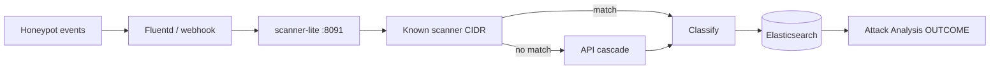

# Scanner Enrichment Lite

Cost-aware IP enrichment for **STINGAR honeypot** traffic. Known scanners are tagged as benign noise; everything else is classified **benign / malicious / suspicious / unknown**, written into Elasticsearch session docs, and shown as an **OUTCOME** column in Attack Analysis.

**Branch:** `scanner-enrichment-lite`  
**Full hybrid platform (central sync, Claude agent):** see branch `threat-enrich-agent` and [REFERENCE.md](REFERENCE.md)

---

## Why this exists

Honeypots see a lot of internet noise. Cortex Xpanse, Censys, Shadowserver, and similar scanners can look “bad” on reputation feeds but are usually **benign probes**. Without scanner-aware triage, analysts waste time on false positives.

This service:

1. Matches source IPs against a **known-scanner inventory** (free, local)
2. If unknown, runs a **cost-aware API cascade** (AbuseIPDB → OTX → GreyNoise, max 3 paid calls)
3. Classifies into **4 outcomes** plus investigation metadata (behavior, frequency, priority)
4. Dual-writes enrichment into **scanner indices** and **STINGAR session documents**
5. Surfaces results in the UI as **OUTCOME** badges on Attack Analysis

No central sync, no sharing policy, no LLM at runtime on this branch.

---

## Quick start (demo)

### Option A — API-only (lightest)

```bash
python -m venv .venv-demo && .venv-demo/bin/pip install -r requirements.txt

export ELASTICSEARCH_URL=http://127.0.0.1:9200
export STINGAR_STORAGE_BACKEND=elasticsearch
export REDIS_URL=redis://127.0.0.1:6379/0
export SCANNER_INVENTORY_BACKEND=redis

# Native ES if Docker disk is tight:
PYTHON=.venv-demo/bin/python ./scripts/deploy-scanner-lite.sh up-native
```

### Option B — Full STINGAR stack + OUTCOME UI

```bash
./scripts/deploy-stingar-demo.sh
# then open Attack Analysis and hard-refresh
```

### Option C — Existing Duke STINGAR VM

```bash
# On the VM (not your laptop):
git checkout scanner-enrichment-lite
export STINGAR_ROOT=~/stingar   # path to docker-compose
./scripts/deploy-stingar-duke-vm.sh
```

**Step-by-step for demos:** [docs/DEMO-DEPLOY.md](docs/DEMO-DEPLOY.md)  
**Boss / stakeholder walkthrough:** [docs/BOSS-GUIDE.md](docs/BOSS-GUIDE.md)

---

## How it works



| Stage | What happens |
|---|---|
| **Ingest** | `POST /webhook/stingar` or `POST /ingest/fluentd` |
| **Tier-0** | Local CSV/Redis scanner inventory (free) |
| **Cascade** | Up to 3 ranked APIs; stop early on high-confidence benign/malicious |
| **Classify** | `benign` · `malicious` · `suspicious` · `unknown` |
| **Store** | `scanner-ip-enrichment-*`, `scanner-asn-batches-*`, `stingar-*` / `stingar-enriched-*` |
| **UI** | OUTCOME column + hover metadata in patched stingar-ui |

---

## Project structure

```
scanner_lite/           # Enrichment service (start here)
  server.py             # FastAPI :8091
  enrich.py             # Orchestration + dual-write
  cascade.py            # Cost-aware API order
  classifier.py         # 4-category outcomes
  session_document.py   # STINGAR session field mapping
  endpoints/            # AbuseIPDB, OTX, GreyNoise, …
config/scanners/        # Known scanner CSV + feed snapshots
deploy/stingar/         # Docker compose + fluentd patch + overlay
vendor/stingar-ui/      # Patched Attack Analysis (OUTCOME column)
vendor/stingar-api/     # Extracted STINGAR API reference
es/                     # Index templates + Kibana dashboards
scripts/                # Deploy, seed, demo helpers
docs/                   # Architecture, demo, integration guides
tests/                  # Unit tests
```

Shared building blocks reused from the full platform: `threat_intel/scanners.py`, `threat_intel/elasticsearch/`.

---

## API surface (scanner-lite)

| Endpoint | Purpose |
|---|---|
| `GET /health` | Liveness + ES reachability |
| `POST /scanner-lite/enrich/events` | Enrich a batch of events |
| `POST /webhook/stingar` | STINGAR-shaped webhook ingest |
| `POST /ingest/fluentd` | Fluentd HTTP forward |
| `GET /scanner-lite/sessions` | Search enriched sessions |
| `GET /scanner-lite/inventory/meta` | Scanner inventory status |

Optional auth on webhook: set `STINGAR_WEBHOOK_SECRET` and send `X-Webhook-Secret`.

### Smoke test

```bash
curl -s -X POST http://127.0.0.1:8091/webhook/stingar \
  -H "Content-Type: application/json" \
  -d '{"srcIp":"198.235.24.10","app":"web","hpData":{"eventType":"service_probe"}}' \
  | python3 -m json.tool
```

Expect `outcome_category: "benign"` for that Cortex Xpanse scanner IP.

---

## Tests

```bash
python -m venv .venv-demo && .venv-demo/bin/pip install -r requirements.txt
.venv-demo/bin/python -m unittest discover -s tests -p 'test_*.py' -v
```

---

## STINGAR integration

Three integration paths:

1. **Sidecar overlay** — add scanner-lite + patched fluentd to an existing STINGAR compose ([`deploy/stingar/scanner-lite.overlay.yml`](deploy/stingar/scanner-lite.overlay.yml))
2. **Full demo stack** — stock STINGAR + scanner-lite + UI build ([`deploy/stingar/docker-compose.yml`](deploy/stingar/docker-compose.yml))
3. **Duke VM** — deploy onto a live VCM host ([`scripts/deploy-stingar-duke-vm.sh`](scripts/deploy-stingar-duke-vm.sh))

Details: [docs/STINGAR-INTEGRATION.md](docs/STINGAR-INTEGRATION.md) · [docs/BOSS-GUIDE.md](docs/BOSS-GUIDE.md)

---

## Documentation

| Doc | Audience |
|---|---|
| **[docs/BOSS-GUIDE.md](docs/BOSS-GUIDE.md)** | Stakeholder walkthrough: demo, test, integrate |
| [docs/DEMO-DEPLOY.md](docs/DEMO-DEPLOY.md) | One-command / Duke VM deploy |
| [docs/SCANNER-LITE.md](docs/SCANNER-LITE.md) | Quick start + API |
| [docs/SCANNER-LITE-DEMO.md](docs/SCANNER-LITE-DEMO.md) | End-to-end curl demo script |
| [docs/SCANNER-LITE-ARCHITECTURE.md](docs/SCANNER-LITE-ARCHITECTURE.md) | Design deep dive |
| [docs/CODE_REVIEW.md](docs/CODE_REVIEW.md) | Reviewer checklist |
| [docs/STINGAR-INTEGRATION.md](docs/STINGAR-INTEGRATION.md) | Production stack wiring |
| [docs/API-CASCADE.md](docs/API-CASCADE.md) | Endpoint ranking / cost model |
| [docs/README.md](docs/README.md) | Full doc index |

---

## Configuration (common env vars)

| Variable | Default / example | Purpose |
|---|---|---|
| `ELASTICSEARCH_URL` | `http://127.0.0.1:9200` | ES cluster |
| `REDIS_URL` | `redis://127.0.0.1:6379/0` | Scanner inventory hot store |
| `SCANNER_INVENTORY_BACKEND` | `redis` | Inventory backend |
| `STINGAR_STORAGE_BACKEND` | `elasticsearch` | Session / enrichment store |
| `STINGAR_WEBHOOK_SECRET` | *(unset)* | Optional webhook auth |
| `ABUSEIPDB_API_KEY` | *(optional)* | Live reputation; cascade degrades gracefully without keys |

---

## Remotes

| Remote | URL |
|---|---|
| GitLab (Duke Code+) | `git@gitlab.oit.duke.edu:codeplus2026/ai_tools.git` |
| GitHub (private) | `git@github.com:Rudhmilaa/threat-intel-agent.git` |

```bash
git checkout scanner-enrichment-lite
git push origin scanner-enrichment-lite
git push github scanner-enrichment-lite
```

---

## License

No license file is included. Treat as internal / private unless otherwise agreed.
