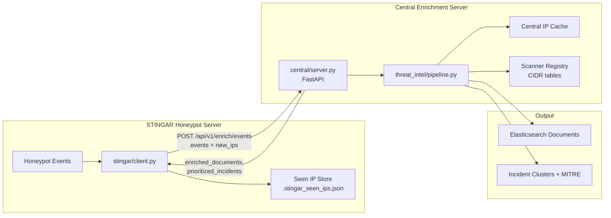
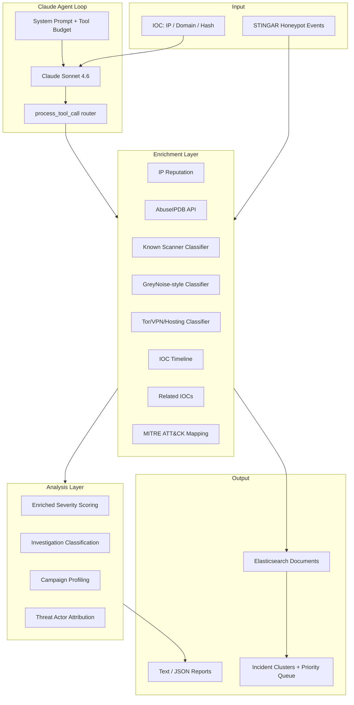

# Threat Intelligence Enrichment Agent

An AI-powered threat intelligence platform that enriches indicators of compromise (IOCs), investigates honeypot telemetry, and produces analyst-ready reports. The system combines a **Claude-based agent loop** with a **multi-source enrichment pipeline** to score risk, classify investigation outcomes, attribute campaigns, and export structured documents for Elasticsearch.

Built for security operations workflows — especially **STINGAR honeypot event enrichment** — where raw attacker IPs need fast, contextual triage without treating every scanner as a critical incident.

---

## Table of Contents

- [Overview](#overview)
- [Distributed Architecture](#distributed-architecture)
- [Architecture](#architecture)
- [Features](#features)
- [Project Structure](#project-structure)
- [Installation](#installation)
- [Configuration](#configuration)
- [Usage](#usage)
- [Core Components](#core-components)
  - [Agent Loop (Claude)](#agent-loop-claude)
  - [Enrichment Tools](#enrichment-tools)
  - [Risk & Severity Scoring](#risk--severity-scoring)
  - [Investigation Classification](#investigation-classification)
  - [Campaign & Threat Actor Attribution](#campaign--threat-actor-attribution)
  - [Report Generation](#report-generation)
  - [STINGAR / Elasticsearch Pipeline](#stingar--elasticsearch-pipeline)
  - [Batch Processing & Incident Management](#batch-processing--incident-management)
- [Sample Data & Test IOCs](#sample-data--test-iocs)
- [Development Stages](#development-stages)
- [Extending the System](#extending-the-system)
- [Limitations & Notes](#limitations--notes)

---

## Overview

This project implements a full threat intelligence enrichment stack across three deployment roles:

1. **Central enrichment server** (`central/server.py`) — receives honeypot events and new IPs from remote STINGAR nodes, runs enrichment, clustering, and prioritization.
2. **STINGAR client** (`stingar/client.py`) — runs on each honeypot server, tracks seen IPs locally, and forwards only new source IPs to central.
3. **Core library** (`main.py` + `threat_intel/`) — shared enrichment engines, scanner tables, MITRE mapping, and Claude agent loop.

The design separates **severity scoring** (how dangerous is this?) from **investigation classification** (what kind of activity is this?). That distinction matters in practice: a Palo Alto Cortex Xpanse or Shadowserver scanner may have thousands of AbuseIPDB reports but should be classified as benign scanner noise, not escalated as C2.

---

## Distributed Architecture



### What the STINGAR client sends

| Field | Required | Description |
|---|---|---|
| `client_id` | Yes | Unique deployment ID (e.g. `duke-stingar-01`) |
| `sensor_id` | No | STINGAR sensor name |
| `events[]` | Yes | Full honeypot event batch |
| `new_ips[]` | Yes | Source IPs seen for the first time on this node |

Each honeypot event should include at minimum:

| Field | Example | Purpose |
|---|---|---|
| `source_ip` | `203.0.113.42` | Attacker IP to enrich |
| `destination_ip` | `10.0.0.25` | Honeypot target |
| `destination_port` | `22` | Service targeted |
| `attack_type` | `ssh_bruteforce` | Normalized attack label |
| `protocol` | `ssh` | Application protocol |
| `transport` | `tcp` | Transport layer |
| `sensor_id` | `stingar-duke-sensor-01` | Originating sensor |
| `honeypot_type` | `cowrie` | Honeypot implementation |

Example request:

```json
{
  "client_id": "example-stingar-01",
  "sensor_id": "stingar-duke-sensor-01",
  "new_ips": ["203.0.113.42"],
  "events": [
    {
      "source_ip": "203.0.113.42",
      "source_port": 55231,
      "destination_ip": "10.0.0.25",
      "destination_port": 22,
      "protocol": "ssh",
      "transport": "tcp",
      "sensor_id": "stingar-duke-sensor-01",
      "honeypot_type": "cowrie",
      "attack_type": "ssh_bruteforce"
    }
  ]
}
```

### What central returns

| Field | Description |
|---|---|
| `enriched_documents[]` | Elasticsearch-ready documents per event |
| `batch_summary` | Severity/classification counts |
| `incident_clusters[]` | Grouped incidents with MITRE ATT&CK context |
| `prioritized_incidents[]` | Analyst priority queue |
| `enrichment_stats` | New vs cached enrichment counts |

### How new-IP deduplication works

1. **STINGAR client** persists every source IP it has ever forwarded in `.stingar_seen_ips.json`.
2. On each batch, the client computes `new_ips = source_ips - seen_ips`.
3. The client sends the full event batch plus the `new_ips` list.
4. **Central server** enriches fresh summaries for `new_ips` and reuses its persistent cache (SQLite or Redis) for repeat IPs.
5. After a successful response, the STINGAR client marks all batch source IPs as seen.

### Persistent central cache

Central stores intelligence summaries in a persistent backend so enrichment survives restarts.

| Setting | Default | Description |
|---|---|---|
| `CENTRAL_CACHE_BACKEND` | `sqlite` | `sqlite` or `redis` |
| `CENTRAL_CACHE_SQLITE_PATH` | `data/central_cache.db` | SQLite database path |
| `REDIS_URL` | `redis://localhost:6379/0` | Redis connection URL when backend is `redis` |

Check cache stats:

```bash
curl http://127.0.0.1:8080/health
curl -H "Authorization: Bearer $CENTRAL_API_KEY" http://127.0.0.1:8080/api/v1/cache/stats
```

### API authentication

Protected endpoints require a Bearer token when keys are configured.

| Setting | Description |
|---|---|
| `CENTRAL_API_KEY` | Master key accepted by all clients |
| `CENTRAL_CLIENT_API_KEYS` | JSON map of `{client_id: api_key}` |
| `config/clients/api_keys.json` | File-based per-client keys (copy from `api_keys.example.json`) |

If no keys are configured, auth is disabled for local development.

Example authenticated request:

```bash
curl -X POST http://127.0.0.1:8080/api/v1/enrich/events \
  -H "Authorization: Bearer $CENTRAL_API_KEY" \
  -H "Content-Type: application/json" \
  -d '{"client_id":"example-stingar-01","events":[...],"new_ips":["203.0.113.42"]}'
```

### Webhook ingestion

Two webhook options are supported:

**Option A — STINGAR pushes directly to central**

```bash
curl -X POST http://127.0.0.1:8080/api/v1/webhooks/stingar/example-stingar-01 \
  -H "Authorization: Bearer $CENTRAL_API_KEY" \
  -H "Content-Type: application/json" \
  -d '{
    "events": [
      {
        "source_ip": "203.0.113.42",
        "destination_ip": "10.0.0.25",
        "destination_port": 22,
        "attack_type": "ssh_bruteforce",
        "protocol": "ssh",
        "honeypot_type": "cowrie"
      }
    ]
  }'
```

Central auto-detects new IPs from its persistent cache — no `new_ips` field required.

**Option B — Local listener on the STINGAR server**

Run a lightweight receiver that normalizes honeypot payloads and forwards to central:

```bash
export CENTRAL_ENRICHMENT_URL=http://central-host:8080
export STINGAR_CLIENT_ID=example-stingar-01
export CENTRAL_API_KEY=your-key
export STINGAR_WEBHOOK_SECRET=optional-local-secret

python -m stingar.webhook_listener
# listens on http://0.0.0.0:8090
```

Point Cowrie/STINGAR HTTP output to:

```bash
POST http://stingar-host:8090/webhook/stingar
Header: X-Webhook-Secret: optional-local-secret
```

### Running the distributed stack

**Terminal 1 — start central server:**

```bash
python -m central.server
# listens on http://0.0.0.0:8080 by default
```

**Terminal 2 — submit events from STINGAR client:**

```bash
export CENTRAL_ENRICHMENT_URL=http://127.0.0.1:8080
export STINGAR_CLIENT_ID=example-stingar-01
python -m stingar.client
```

**Enrich IPs only (no honeypot event context):**

```bash
curl -X POST http://127.0.0.1:8080/api/v1/enrich/ips \
  -H 'Content-Type: application/json' \
  -d '{"client_id":"example-stingar-01","ip_addresses":["203.0.113.42"]}'
```

### Central API endpoints

| Method | Path | Auth | Purpose |
|---|---|---|---|
| `GET` | `/health` | No | Health check + cache stats |
| `GET` | `/api/v1/cache/stats` | Yes | Cache backend statistics |
| `POST` | `/api/v1/enrich/events` | Yes | Full STINGAR batch pipeline |
| `POST` | `/api/v1/enrich/ip` | Yes | Single IP intelligence summary |
| `POST` | `/api/v1/enrich/ips` | Yes | Batch IP summaries |
| `POST` | `/api/v1/webhooks/stingar` | Yes | STINGAR push webhook (client_id in body) |
| `POST` | `/api/v1/webhooks/stingar/{client_id}` | Yes | STINGAR push webhook (client_id in path) |
| `GET` | `/api/v1/scanners?client_id=` | Yes | List merged scanner definitions |
| `GET` | `/api/v1/scanners/table?client_id=` | Yes | Flat CIDR table (one row per range) |
| `POST` | `/api/v1/scanners` | Yes | Add a client-owned scanner |
| `DELETE` | `/api/v1/scanners/{scanner_id}?client_id=` | Yes | Remove a client-owned scanner |

### Known scanner CIDR tables

Global defaults live in `config/scanners/default_scanners.json`:

| Scanner ID | Organization | Range type |
|---|---|---|
| `cortex-xpanse` | Palo Alto Cortex Xpanse | Multiple IPv4 CIDR blocks |
| `censys` | Censys | Multiple IPv4 CIDR blocks |
| `shodan` | Shodan | IPv4 CIDR blocks |
| `shadowserver` | The Shadowserver Foundation | IPv4 + IPv6 CIDR blocks |

Each client can maintain its own table at `config/clients/{client_id}_scanners.json`. Client entries merge on top of defaults; a matching `id` overrides the global entry.

**View the flat range table:**

```bash
curl 'http://127.0.0.1:8080/api/v1/scanners/table?client_id=example-stingar-01'
```

**Add a client scanner via API:**

```bash
curl -X POST http://127.0.0.1:8080/api/v1/scanners \
  -H 'Content-Type: application/json' \
  -d '{
    "client_id": "example-stingar-01",
    "scanner": {
      "id": "campus-scanner",
      "company": "Campus Approved Scanner",
      "category": "internal_vulnerability_scanner",
      "ranges": ["10.200.50.0/24"],
      "notes": "Weekly approved internal scan range"
    }
  }'
```

Or edit `config/clients/example-stingar-01_scanners.json` directly.

---

## Architecture



### Data flow for a single IP investigation

```
User IOC
  → run_threat_intel_agent()
    → Claude calls build_intelligence_summary_tool()
      → lookup_ip_reputation()
      → classify_known_scanner()
      → classify_anonymizer_network()
      → classify_greynoise()
      → lookup_ioc_timeline()
      → calculate_enriched_severity()
      → classify_investigation_outcome()  [uses AbuseIPDB with mock fallback]
      → find_related_iocs() → build_campaign_profile() → attribute_threat_actor()
    → Claude writes final analyst report
```

### Data flow for honeypot batch enrichment

```
STINGAR events[]
  → enrich_honeypot_events_with_cache()   # deduplicates by source_ip
    → build_intelligence_summary() per unique IP
    → convert_to_elastic_document() per event
  → summarize_enriched_batch()              # aggregate metrics
  → build_incident_clusters()               # group by source_ip + campaign
  → prioritize_incidents()                  # sort by priority_score
```

---

## Features

| Capability | Description |
|---|---|
| **Agentic IOC investigation** | Claude orchestrates tool calls with a strict budget to avoid runaway API costs |
| **Multi-source IP enrichment** | Reputation, scanner attribution, anonymizer detection, GreyNoise-style noise classification, timeline |
| **Real + mock backends** | AbuseIPDB is live; most other sources use curated mock databases for development |
| **Investigation outcome taxonomy** | Distinguishes C2, known scanners, benign noise, Tor/VPN, suspicious hosting, active recon |
| **Campaign clustering** | Links related IPs, domains, hashes, and malware families |
| **Threat actor attribution** | Maps malware families to known actors (e.g., Emotet → TA505) |
| **MITRE ATT&CK mapping** | Maps behaviors to technique IDs with detection suggestions |
| **Elasticsearch export** | Converts honeypot events + enrichment into ECS-style documents |
| **Batch caching** | Avoids re-enriching the same source IP across multiple events |
| **Incident clustering & prioritization** | Groups events, detects recurring attackers, ranks incidents for analyst queues |

---

## Project Structure

```
threat-intel-agent/
├── main.py                         # Core enrichment engine + Claude agent loop
├── threat_intel/
│   ├── scanners.py                 # ScannerRegistry (global + client CIDR tables)
│   ├── pipeline.py                 # Central enrichment orchestration
│   └── protocols.py                # Client <-> central HTTP payload schemas
├── central/
│   └── server.py                   # FastAPI central enrichment server
├── stingar/
│   ├── client.py                   # STINGAR-side client + seen-IP store
│   └── webhook_listener.py         # Local webhook receiver for honeypot pushes
├── config/
│   ├── scanners/
│   │   └── default_scanners.json   # Global scanner CIDR table
│   └── clients/
│       ├── {client_id}_scanners.json  # Per-client scanner overrides
│       └── api_keys.example.json      # Per-client API key template
├── data/                           # SQLite cache (gitignored)
├── requirements.txt
├── .env                            # API keys (not committed)
└── README.md
```

All logic lives in `main.py`, organized into numbered stages (see [Development Stages](#development-stages)).

---

## Installation

### Prerequisites

- Python 3.10+ (tested with 3.14)
- An [Anthropic API key](https://console.anthropic.com/) for the Claude agent
- An [AbuseIPDB API key](https://www.abuseipdb.com/) (optional but recommended for live IP reputation)

### Setup

```bash
git clone <repository-url>
cd threat-intel-agent

python -m venv .venv
source .venv/bin/activate   # Windows: .venv\Scripts\activate

pip install anthropic python-dotenv requests
```

Create a `.env` file in the project root:

```env
ANTHROPIC_API_KEY=your_anthropic_api_key_here
ABUSEIPDB_API_KEY=your_abuseipdb_api_key_here
```

---

## Configuration

| Variable | Required | Purpose |
|---|---|---|
| `ANTHROPIC_API_KEY` | Yes (for agent mode) | Authenticates Claude API calls in `run_threat_intel_agent()` |
| `ABUSEIPDB_API_KEY` | No | Live IP reputation via AbuseIPDB; falls back to mock data if missing |
| `CENTRAL_ENRICHMENT_URL` | STINGAR client | Base URL of central server (e.g. `http://10.0.0.5:8080`) |
| `STINGAR_CLIENT_ID` | STINGAR client | Client ID used for scanner table merge and cache partitioning |
| `STINGAR_SENSOR_ID` | STINGAR client | Default sensor ID attached to submitted batches |
| `STINGAR_SEEN_IP_STORE` | STINGAR client | Path to local seen-IP JSON store (default: `.stingar_seen_ips.json`) |
| `CENTRAL_HOST` / `CENTRAL_PORT` | Central server | Bind address for FastAPI (default: `0.0.0.0:8080`) |
| `CENTRAL_API_KEY` | Optional | Master Bearer token for central API auth |
| `CENTRAL_CLIENT_API_KEYS` | Optional | JSON map of per-client API keys |
| `CENTRAL_CACHE_BACKEND` | Central server | `sqlite` (default) or `redis` |
| `CENTRAL_CACHE_SQLITE_PATH` | Central server | SQLite cache database path |
| `REDIS_URL` | Central server | Redis URL when using redis cache backend |
| `STINGAR_WEBHOOK_HOST` / `STINGAR_WEBHOOK_PORT` | STINGAR listener | Bind address (default `0.0.0.0:8090`) |
| `STINGAR_WEBHOOK_SECRET` | STINGAR listener | Optional shared secret for local webhook auth |

Additional constants in `main.py`:

| Constant | Default | Purpose |
|---|---|---|
| `MODEL_NAME` | `claude-sonnet-4-6` | Claude model used by the agent |
| `MAX_TURNS` | `4` | Maximum agent loop iterations (cost guardrail) |

---

## Usage

### Run the built-in demo suite

The `if __name__ == "__main__"` block at the bottom of `main.py` runs a comprehensive test suite covering AbuseIPDB lookups, investigation classification, campaign profiling, Elasticsearch document generation, batch enrichment, clustering, and prioritization:

```bash
python main.py
```

### Investigate an IOC with Claude (agent mode)

Uncomment the agent test block in `main.py`, or call directly:

```python
from main import run_threat_intel_agent

analysis, tool_calls = run_threat_intel_agent(
    ioc="203.0.113.42",
    ioc_type="ip_address"
)

print(f"Tools used: {len(tool_calls)}")
for call in tool_calls:
    print(f"  - {call['tool']}: {call['input']}")

print(analysis)
```

Supported `ioc_type` values: `ip_address`, `domain`, `file_hash`.

You can also normalize types with `standardize_ioc_type()` — it maps aliases like `ip`, `ipv4`, `md5`, `sha256` to canonical names.

### Run without Claude (mock agent)

For offline testing without API costs:

```python
from main import run_mock_agent

run_mock_agent("203.0.113.42", "ip_address")
run_mock_agent("d131dd02c5e6eec4693d9a0698aff95c", "file_hash")
run_mock_agent("secure-bankofamerica-login.com", "domain")
```

### Enrich honeypot events programmatically

```python
from main import (
    enrich_honeypot_events_with_cache,
    summarize_enriched_batch,
    build_incident_clusters,
    prioritize_incidents,
)

events = [
    {
        "source_ip": "203.0.113.42",
        "source_port": 55231,
        "destination_ip": "10.0.0.25",
        "destination_port": 22,
        "protocol": "ssh",
        "transport": "tcp",
        "sensor_id": "stingar-duke-sensor-01",
        "honeypot_type": "cowrie",
        "attack_type": "ssh_bruteforce",
    },
    # ... more events
]

docs = enrich_honeypot_events_with_cache(events)
summary = summarize_enriched_batch(docs)
clusters = build_incident_clusters(docs)
queue = prioritize_incidents(clusters)
```

### Generate a structured JSON threat report

```python
from main import lookup_file_hash, export_report_json
import json

data = lookup_file_hash("d131dd02c5e6eec4693d9a0698aff95c", "md5")
report = export_report_json("d131dd02c5e6eec4693d9a0698aff95c", "file_hash", data)

with open("threat_report.json", "w") as f:
    json.dump(report, f, indent=2)
```

---

## Core Components

### Agent Loop (Claude)

The agent is implemented in `run_threat_intel_agent()`. It uses Anthropic's tool-use API to let Claude autonomously select enrichment tools.

**Key design decisions:**

- **`SYSTEM_PROMPT`** instructs Claude to call `build_intelligence_summary_tool` first for IP investigations, use at most 8 tool calls, and stop after enriched severity is calculated.
- **`MAX_TURNS = 4`** prevents infinite loops and runaway API costs.
- **`process_tool_call()`** routes Claude's tool requests to Python backend functions and returns JSON-serialized results.

```python
# Simplified agent loop
for turn in range(MAX_TURNS):
    response = client.messages.create(
        model=MODEL_NAME,
        max_tokens=3000,
        system=SYSTEM_PROMPT,
        tools=tools,
        messages=messages,
    )

    if response.stop_reason == "end_turn":
        return final_text, tool_calls_made

    if response.stop_reason == "tool_use":
        # Execute tools, append results, continue loop
        ...
```

#### Registered tools (14 total)

| Tool Name | Backend Function | Purpose |
|---|---|---|
| `lookup_ip_reputation` | `lookup_ip_reputation()` | Mock IP reputation database |
| `lookup_ip_reputation_abuseipdb` | `lookup_ip_reputation_abuseipdb()` | Live AbuseIPDB API |
| `lookup_file_hash` | `lookup_file_hash()` | Mock antivirus/file reputation |
| `lookup_domain` | `lookup_domain()` | Mock domain reputation |
| `get_mitre_techniques` | `get_mitre_techniques()` | MITRE ATT&CK technique mapping |
| `find_related_iocs` | `find_related_iocs()` | Pivot to related indicators |
| `classify_known_scanner` | `classify_known_scanner()` | Detect Censys/Shodan/Xpanse scanners |
| `lookup_ioc_timeline` | `lookup_ioc_timeline()` | First/last seen, observation counts, trends |
| `analyze_ip_version` | `analyze_ip_version()` | IPv4/IPv6 validation and properties |
| `classify_greynoise` | `classify_greynoise()` | Internet noise vs. malicious classification |
| `classify_anonymizer_network` | `classify_anonymizer_network()` | Tor/VPN/proxy/bulletproof hosting detection |
| `calculate_enriched_severity_tool` | `calculate_enriched_severity_tool()` | Composite threat score for an IP |
| `classify_investigation_outcome_tool` | `classify_investigation_outcome_tool()` | Activity type classification |
| `build_intelligence_summary_tool` | `build_intelligence_summary()` | Full enrichment bundle for an IP |

---

### Enrichment Tools

#### IP Reputation

- **`lookup_ip_reputation(ip_address)`** — Mock database with two sample malicious IPs (`203.0.113.42`, `198.51.100.17`). Returns geolocation, abuse score, threat types, malware associations, open ports, and tags.
- **`lookup_ip_reputation_abuseipdb(ip_address)`** — Calls the real [AbuseIPDB Check API](https://docs.abuseipdb.com/#check). Returns abuse confidence score, report counts, ISP, hostnames, and report categories. Gracefully handles missing API keys and network errors.

#### File Hash Reputation

- **`lookup_file_hash(file_hash, hash_type)`** — Mock database. Returns detection ratio, malware family, behavior summary, and contacted IPs/domains. Supports `md5`, `sha1`, `sha256`.

#### Domain Reputation

- **`lookup_domain(domain)`** — Mock database with phishing and malware C2 domains. Returns reputation score, category, registrar, hosting provider, and associated malware.

#### Related IOCs

- **`find_related_iocs(ioc, ioc_type)`** — Returns connected IPs, domains, hashes, malware families, and a relationship summary. Enables pivoting from one indicator to broader campaign infrastructure.

#### Known Scanner Classification

- **`classify_known_scanner(ip_address)`** — Checks the IP against CIDR ranges for:
  - Palo Alto Networks Cortex Xpanse
  - Censys
  - Shodan

  Returns `is_known_scanner`, company name, matched range, and analyst notes. This is critical for reducing false positives on honeypot data.

#### Anonymizer & Hosting Classification

- **`classify_anonymizer_network(ip_address)`** — Detects Tor exit nodes, commercial VPNs, and bulletproof hosting providers from a mock database.

#### GreyNoise-style Classification

- **`classify_greynoise(ip_address)`** — Simulates GreyNoise internet noise classification: `malicious`, `benign_scanner`, `suspicious`, or `unknown`.

#### IOC Timeline

- **`lookup_ioc_timeline(ioc, ioc_type)`** — Returns first seen, last seen, observation count, days active, and activity trend (`increasing`, `stable`, `unknown`).

#### IP Version Analysis

- **`analyze_ip_version(ip_address)`** — Uses Python's `ipaddress` module to validate IPs and return version, private/global/loopback/multicast flags.

#### MITRE ATT&CK Mapping

- **`get_mitre_techniques(query)`** — Maps natural-language queries to technique IDs, associated threat groups, and detection suggestions. Supports: command and control, credential theft, phishing, lateral movement.

---

### Risk & Severity Scoring

Two scoring functions serve different purposes:

#### Basic risk score — `calculate_risk_score(data)`

A simpler score (0–100) used for text/JSON report generation. Factors:

- Abuse confidence score tiers (40/30/20 points)
- Antivirus detection counts (40/25/10 points)
- Known malware family (+30)
- Threat type count (up to +25)
- Domain reputation and category boosts

Severity bands: `CRITICAL` (≥85), `HIGH` (≥65), `MEDIUM` (≥40), `LOW`.

#### Enriched severity — `calculate_enriched_severity(...)`

The primary scoring engine for IP investigations. Combines five enrichment sources:

| Signal | Effect |
|---|---|
| High abuse confidence (≥90) | +35 threat, +25 confidence |
| Threat types observed | Up to +25 threat |
| Known malware associations | +25 threat |
| Known scanner detected | **−30 threat** (reduces false positives) |
| Tor exit node | +20 threat |
| Commercial VPN | +10 threat |
| Bulletproof hosting | +25 threat |
| GreyNoise malicious | +30 threat |
| GreyNoise benign scanner | **−25 threat** |
| High observation count (≥1000) | +15 threat |
| Increasing activity trend | +10 threat |

Returns `threat_score`, `confidence_score`, `severity`, and a list of human-readable `risk_factors`.

**Severity bands:** `CRITICAL`, `HIGH`, `MEDIUM`, `LOW`, `INFORMATIONAL`.

`calculate_enriched_severity_tool(ip_address)` is the convenience wrapper that gathers all inputs and calls the scorer.

---

### Investigation Classification

`classify_investigation_outcome()` answers **what kind of activity is this?** — separate from how severe it is.

| Classification | Category | Priority | Trigger |
|---|---|---|---|
| `confirmed_malicious_infrastructure` | malicious | critical | C2/malware threat types or GreyNoise malicious |
| `known_scanner_high_noise` | benign_but_noisy | low | Known scanner + ≥100 reports |
| `known_scanner` | benign_scanner | informational | Known scanner match |
| `anonymized_traffic_tor` | anonymizer | medium | Tor exit node |
| `anonymized_traffic_vpn` | anonymizer | low | Commercial VPN |
| `suspicious_hosting` | suspicious_infrastructure | high | Bulletproof hosting |
| `active_reconnaissance_or_abuse` | suspicious | high | High abuse score without scanner attribution |
| `benign_internet_noise` | benign_noise | informational | GreyNoise benign scanner |
| `unknown` | unknown | review | No strong signal |

`classify_investigation_outcome_tool(ip_address)` uses AbuseIPDB for reputation (with mock fallback) and combines all enrichment sources.

---

### Campaign & Threat Actor Attribution

#### Campaign profiling — `build_campaign_profile(ioc, ioc_type)`

Uses `find_related_iocs()` to discover linked infrastructure, then infers:

- Campaign name (e.g., "Emotet Infrastructure Cluster")
- Campaign type (`botnet_c2`, `credential_theft`)
- Confidence score
- Related IPs, domains, hashes, malware families

#### Threat actor attribution — `attribute_threat_actor(campaign_profile)`

Maps malware families to known actors:

| Malware Family | Threat Actor | Motivation |
|---|---|---|
| Emotet | TA505 | Financially Motivated Cybercrime |
| Trickbot | Wizard Spider | Financially Motivated Cybercrime |

#### Full summary — `build_intelligence_summary(ip_address)`

Orchestrates the complete enrichment pipeline and returns a single dict with severity, investigation, campaign, and threat actor sections. This is the primary entry point for programmatic IP enrichment.

---

### Report Generation

| Function | Output | Use Case |
|---|---|---|
| `generate_threat_report(ioc, data)` | Plain-text analyst report | Console output, email alerts |
| `export_report_json(ioc, ioc_type, data)` | Structured JSON dict | API responses, file export |
| `get_recommended_actions(severity)` | Action list by severity | Embedded in reports |
| `build_relationship_graph(hash_data)` | IOC relationship tree | Visualizing hash → IP → domain links |
| `display_relationship_graph(graph)` | ASCII tree printout | Console debugging |

Example JSON report structure (see `threat_report.json`):

```json
{
  "ioc": "d131dd02c5e6eec4693d9a0698aff95c",
  "ioc_type": "file_hash",
  "risk_score": 70,
  "severity": "HIGH",
  "malware_family": "Emotet",
  "recommended_actions": [
    "Investigate immediately",
    "Search environment for related indicators",
    "Increase monitoring"
  ]
}
```

---

### STINGAR / Elasticsearch Pipeline

Designed to enrich **STINGAR honeypot** events into documents ready for Elasticsearch indexing.

#### Honeypot event schema (input)

```python
{
    "source_ip": "203.0.113.42",
    "source_port": 55231,
    "destination_ip": "10.0.0.25",
    "destination_port": 22,
    "protocol": "ssh",
    "transport": "tcp",
    "sensor_id": "stingar-duke-sensor-01",
    "honeypot_type": "cowrie",
    "attack_type": "ssh_bruteforce",
}
```

#### Elasticsearch document schema (output)

`convert_to_elastic_document(honeypot_event, intelligence_summary)` produces:

```
@timestamp
event.source / event.type / event.original
source.ip / source.port
destination.ip / destination.port
network.protocol / network.transport
stingar.sensor_id / stingar.honeypot_type / stingar.attack_type
threat.indicator / threat.severity / threat.threat_score / threat.confidence_score / threat.risk_factors
investigation.classification / investigation.category / investigation.priority / investigation.reasons
campaign.name / campaign.type / campaign.malware_families / campaign.related_*
threat_actor.name / threat_actor.confidence / threat_actor.motivation
elastic_metadata.document_type / elastic_metadata.pipeline / elastic_metadata.version
```

---

### Batch Processing & Incident Management

The batch pipeline transforms raw honeypot event streams into prioritized analyst work queues.

#### Step 1: Enrich events

- **`enrich_honeypot_events(events)`** — Enriches each event independently (no caching).
- **`enrich_honeypot_events_with_cache(events)`** — Caches `build_intelligence_summary()` results per `source_ip`. Adds `cache_status` (`hit`/`miss`) to document metadata.

#### Step 2: Summarize batch

**`summarize_enriched_batch(enriched_documents)`** returns:

- Total event count
- Severity distribution
- Investigation classification distribution
- Cache hit/miss counts
- Top source IPs by event count
- List of critical events with campaign and threat actor context

#### Step 3: Cluster incidents

**`build_incident_clusters(enriched_documents)`** groups events by `source_ip + campaign_name`. Each cluster includes:

- Incident ID
- Source IP, campaign, campaign type, threat actor
- Severity and recommended action
- Recurrence data from `detect_recurring_attacker()`
- Event count, attack types, destination ports, malware families
- **`mitre_attack`** — MITRE ATT&CK context derived from the cluster:
  - `techniques` — deduplicated technique IDs, names, and tactics
  - `tactics` — unique ATT&CK tactics across all mapped techniques
  - `detection_suggestions` — merged analyst detection guidance
  - `mapping_sources` — which signals drove the mapping (attack type, campaign type, malware family)

MITRE mapping is built by `build_cluster_mitre_attack()`, which combines:

| Signal | Example | MITRE Query / Mapping |
|---|---|---|
| Honeypot attack type | `ssh_bruteforce` | T1110.001 Password Guessing, T1021.004 SSH |
| Honeypot attack type | `service_probe` | T1046 Network Service Discovery, T1595.002 Vulnerability Scanning |
| Campaign type | `botnet_c2` | Command and Control techniques |
| Malware family | `Emotet` | Command and Control techniques |
| Malware family | `Trickbot` | Credential theft techniques |

Example cluster MITRE block:

```json
"mitre_attack": {
  "techniques": [
    {"id": "T1110.001", "name": "Password Guessing", "tactic": "Credential Access"},
    {"id": "T1071.001", "name": "Web Protocols", "tactic": "Command and Control"}
  ],
  "tactics": ["Command and Control", "Credential Access", "Lateral Movement"],
  "detection_suggestions": [
    "Alert on repeated failed SSH authentication attempts from a single source IP",
    "Monitor for unusual outbound HTTPS to non-standard ports"
  ],
  "mapping_sources": [
    "attack_type:ssh_bruteforce",
    "campaign_type:botnet_c2",
    "malware_family:Emotet"
  ]
}
```

#### Step 4: Prioritize

**`prioritize_incidents(incident_clusters)`** assigns a `priority_score` based on:

```
priority_score = severity_weight
               + (event_count × 5)
               + recurrence_bonus (up to +30)
               + trend_bonus (+15 if increasing)
```

Severity weights: CRITICAL=100, HIGH=75, MEDIUM=50, LOW=25, INFORMATIONAL=0.

Returns clusters sorted by priority (highest first).

#### Recurring attacker detection

**`detect_recurring_attacker(ip_address)`** checks historical activity:

- `recurring_source` — ≥10 historical events
- `has_prior_incidents` — prior incident count > 0
- Trend and recommendation (escalate, review history, monitor)

---

## Sample Data & Test IOCs

The mock databases include interconnected sample data for end-to-end testing:

| IOC | Type | Scenario |
|---|---|---|
| `203.0.113.42` | IP | Emotet/Trickbot C2, high abuse score, malicious GreyNoise classification |
| `198.51.100.17` | IP | APT C2 (PlugX/ShadowPad), state-sponsored tags |
| `198.235.24.10` | IP | Palo Alto Cortex Xpanse scanner (benign) |
| `185.220.101.1` | IP | Tor exit node |
| `45.134.26.12` | IP | Commercial VPN |
| `d131dd02c5e6eec4693d9a0698aff95c` | MD5 hash | Emotet dropper, 80.6% detection rate |
| `secure-bankofamerica-login.com` | Domain | Phishing kit targeting Bank of America |
| `update-service-cdn.ru` | Domain | Emotet C2 domain |

These IOCs are linked — investigating any one reveals related indicators across the graph.

---

## Development Stages

The code in `main.py` is organized into numbered stages reflecting incremental development:

| Stage | Section | What Was Built |
|---|---|---|
| 1 | Imports & config | Anthropic client, env loading, IOC type normalization |
| 2 | Tool definitions | 14 Claude tool schemas |
| 3 | Simulated backends | Mock databases for IP, hash, domain, MITRE |
| 3+ | Real API | AbuseIPDB integration |
| — | Risk scoring | Basic and enriched severity engines |
| — | Classification | Investigation outcome taxonomy |
| — | Campaign/actor | Profile building and attribution |
| — | Elastic export | STINGAR → Elasticsearch document converter |
| — | Reports | Text, JSON, relationship graph generation |
| 4 | Agent loop | Claude tool-use orchestration |
| 5 | Sample IOCs / mock agent | Offline testing without API |
| 6 | Related IOCs | Indicator pivoting |
| 7 | Known scanner classifier | Censys/Shodan/Xpanse CIDR matching |
| 8 | Timeline, GreyNoise, anonymizer | Additional enrichment dimensions |
| — | Batch pipeline | Honeypot enrichment, caching, summarization |
| — | Incident management | Clustering, prioritization, recurring attacker detection |

---

## Extending the System

### Adding a new enrichment tool

1. **Write the backend function** returning a `dict`.
2. **Add a tool schema** to the `tools` list with name, description, and `input_schema`.
3. **Register the handler** in `process_tool_call()`'s `handlers` dict.
4. **Update `SYSTEM_PROMPT`** if the tool changes investigation workflow.

### Replacing mock data with live APIs

Mock functions follow a consistent pattern — return a dict with standardized keys. To integrate a real API:

1. Copy the mock function (e.g., `lookup_ip_reputation`).
2. Replace the static database lookup with an HTTP call (see `lookup_ip_reputation_abuseipdb` as a template).
3. Map the API response to the same dict keys so downstream scoring/classification continues to work.
4. Add the API key to `.env`.

### Splitting into modules

The single-file design is intentional for development velocity. A natural module split would be:

```
threat_intel/
├── agent.py          # Agent loop, system prompt, tool routing
├── tools/            # Individual enrichment backends
├── scoring.py        # Risk and severity engines
├── classification.py # Investigation outcome logic
├── campaign.py       # Campaign profiling and attribution
├── reports.py        # Report generation
├── elastic.py        # Elasticsearch document conversion
└── batch.py          # Batch enrichment, clustering, prioritization
```

---

## Limitations & Notes

- **Mock data dominates.** Most enrichment sources (hash reputation, domain reputation, GreyNoise, timeline, anonymizer detection) use hardcoded sample databases. Only AbuseIPDB is a live integration.
- **Threat actor attribution is rule-based.** Campaign and actor mapping uses simple malware-family → actor rules, not ML or threat intel feeds.
- **No persistent storage.** Caching is in-memory per batch run. There is no database or cache layer across runs.
- **Agent cost guardrails.** `MAX_TURNS = 4` and tool budget rules in the system prompt limit Claude API usage, but costs scale with investigation volume.
- **RFC 5737 test IPs.** Sample IPs use documentation ranges (`203.0.113.0/24`, `198.51.100.0/24`, `192.0.2.0/24`) — safe for testing, not real threats.
- **No authentication or API server.** This is a library/script, not a deployed service. Wrap in FastAPI/Flask for production use.
- **Secrets in `.env`.** Never commit `.env` to version control. It is listed in `.gitignore`.

---

## License

No license file is included. Add one before open-sourcing or distributing.
