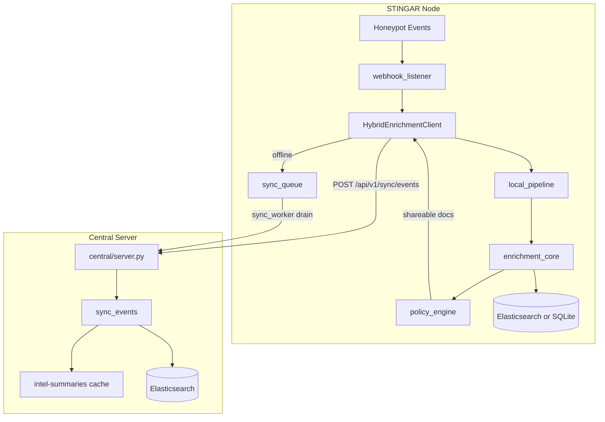
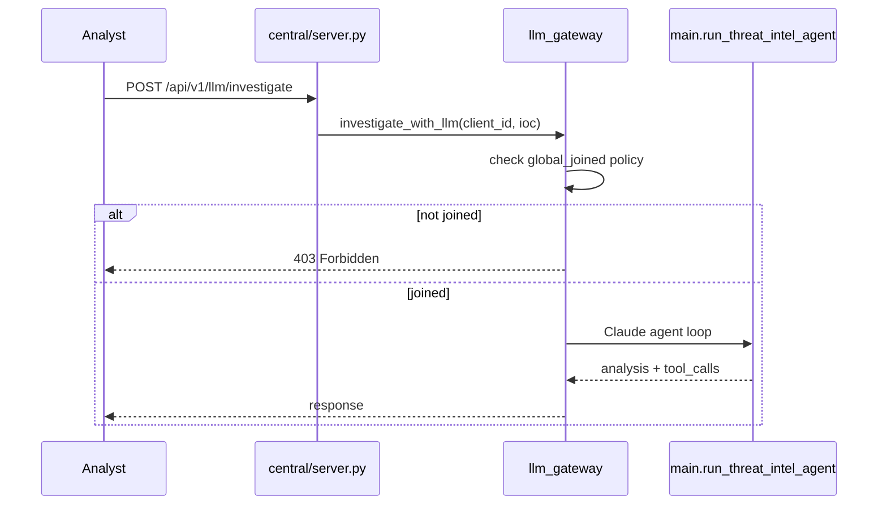

# Architecture

System design for the threat-intel-agent hybrid enrichment platform.

## Problem statement

STINGAR honeypots generate high-volume attacker IP telemetry. Not every source IP is malicious:

- **Known scanners** (Cortex Xpanse, Censys, Shadowserver) may have high AbuseIPDB scores but should be classified as benign probe traffic.
- **Internal or safelisted ranges** must not trigger block/escalate workflows.
- **Private destination IPs** must not leave the deployment when syncing to a central aggregator.

This repo separates **severity** (how dangerous?) from **investigation classification** (what kind of activity?) and runs enrichment **locally first**, with optional policy-gated sync to a central server.

## Deployment roles

| Role | Location | Entry point |
|---|---|---|
| **STINGAR webhook listener** | Each honeypot server | `stingar/webhook_listener.py` |
| **Hybrid enrichment client** | Library used by listener | `stingar/client.py` |
| **Central enrichment server** | Shared aggregator | `central/server.py` |
| **Core enrichment library** | Imported everywhere | `threat_intel/` |
| **Claude agent** | Central LLM gateway only | `main.py` + `central/llm_gateway.py` |

## Deployment topologies

### Single-node local

```
Honeypot → webhook_listener → local_pipeline → ES/SQLite
```

Set `STINGAR_DEPLOYMENT_MODE=local_only`. No central URL required. Enrichment and storage stay on-box.

### Hybrid (default)

```
Honeypot → webhook_listener → HybridEnrichmentClient
                                  ├─ local enrich (always)
                                  ├─ ES write (local store)
                                  └─ POST /api/v1/sync/events (when online + allowed)
                                        → central merges + indexes
```

Central can be unreachable; local enrichment still completes. Failed syncs queue in `data/sync_queue.db`.

### Central + N STINGAR nodes

```
STINGAR-1 ──┐
STINGAR-2 ──┼── sync/events ──▶ central/server.py ──▶ ES + cache
STINGAR-N ──┘
Analyst ── GET /api/v1/sessions ──▶ central
```

Each node has its own `client_id`, sharing policy, and optional scanner/safelist overrides.

## Data flow: event ingest



## Data flow: central direct enrich (legacy path)

STINGAR nodes can also POST raw events directly to central (no local enrich first):

```
STINGAR → POST /api/v1/enrich/events → threat_intel/pipeline → enrichment_core
```

The **recommended path** is local-first via `HybridEnrichmentClient` + sync. Direct central enrich remains for simpler deployments and tests.

## Data flow: LLM gateway



Local STINGAR nodes **never** call the LLM directly. Set `STINGAR_ENABLE_LLM=false` on nodes as an extra guard.

## Component map

```
threat-intel-agent/
├── central/                 # FastAPI central server
│   ├── server.py            # REST API
│   ├── auth.py              # Bearer token auth
│   └── llm_gateway.py       # Global LLM gate
├── stingar/                 # STINGAR-side deployment
│   ├── client.py            # HybridEnrichmentClient
│   ├── webhook_listener.py  # Local event receiver
│   ├── sync_queue.py        # Offline sync queue
│   └── sync_worker.py       # Queue drain utility
├── threat_intel/            # Shared enrichment library
│   ├── enrichment_core.py   # Batch orchestration (no main.py import)
│   ├── local_pipeline.py    # Local-first wrapper
│   ├── lookups.py           # IOC lookup backends
│   ├── severity.py          # Threat scoring
│   ├── investigation.py     # Outcome classification
│   ├── campaign.py          # Campaign / actor attribution
│   ├── incidents.py         # Clustering + MITRE + priority
│   ├── documents.py         # ES document conversion
│   ├── scanners.py          # Scanner registry (Tier-0)
│   ├── safelist.py          # Safelist registry
│   ├── policy_engine.py     # Policy application + shareability
│   ├── sharing_policy.py    # Per-client deployment policy
│   ├── taxonomy.py          # Structured analyst tags
│   └── elasticsearch/       # ES client, store, session query
├── config/
│   ├── scanners/            # CSV inventory + feed snapshots
│   ├── safelist/            # Default safelist
│   └── clients/             # Per-client overrides
├── es/                      # Index templates + ILM policy
└── main.py                  # Claude agent + tool re-exports
```

## Module dependency graph

```
webhook_listener → HybridEnrichmentClient → local_pipeline → enrichment_core
                                                              ├─ intelligence_summary
                                                              ├─ documents
                                                              ├─ incidents
                                                              ├─ policy_engine
                                                              └─ storage (ES/SQLite)

central/server → pipeline / enrichment_core (direct enrich path)
              → sync_events (merge only, re-validates policy)
              → llm_gateway → main.run_threat_intel_agent

enrichment_core does NOT import main.py
```

Post-H1 refactor: deterministic enrichment lives entirely under `threat_intel/`. `main.py` is agent-only plus backward-compatible re-exports.

## Trust boundaries

| Data | Stays local | May sync to central |
|---|---|---|
| Full honeypot event (`event.original`) | Default: stripped on sync | Never by default |
| Destination IP | Default: stripped | Blocked if private CIDR |
| Sensor ID | Default: stripped | Configurable |
| Source IP + enrichment verdict | Stored locally always | Yes, if policy allows |
| Safelisted / internal-tagged events | Annotated locally | Blocked by `never_share_if_tags` |
| LLM investigation output | N/A on node | Central-only service |

Central **re-runs** `evaluate_shareability()` on every document in `POST /api/v1/sync/events`. If all documents are rejected, central returns **403**.

## Storage backends

| Backend | When | Indices / tables |
|---|---|---|
| **Elasticsearch** (default prod) | `STINGAR_STORAGE_BACKEND=elasticsearch` | `stingar-YYYY-MM-DD`, `intel-summaries` |
| **SQLite** (tests, air-gapped dev) | `STINGAR_STORAGE_BACKEND=sqlite` | `data/local_cache.db`, `data/central_cache.db` |

See [DATA-MODEL.md](./DATA-MODEL.md) for schema details.

## Out of scope

This repo does **not** implement:

- Payload / file-hash object registry
- C2 evidence ladder (referenced-in-payload, beaconing stages)
- Playbook / edge graph indices
- Fluent Bit–compatible local ingest via STINGAR message cube (planned — see [ROADMAP.md](./ROADMAP.md))

## Related docs

- [ENRICHMENT.md](./ENRICHMENT.md) — pipeline internals
- [POLICY-AND-SHARING.md](./POLICY-AND-SHARING.md) — sync and privacy rules
- [DEPLOYMENT.md](./DEPLOYMENT.md) — how to run each role
- [API-REFERENCE.md](./API-REFERENCE.md) — REST endpoints
