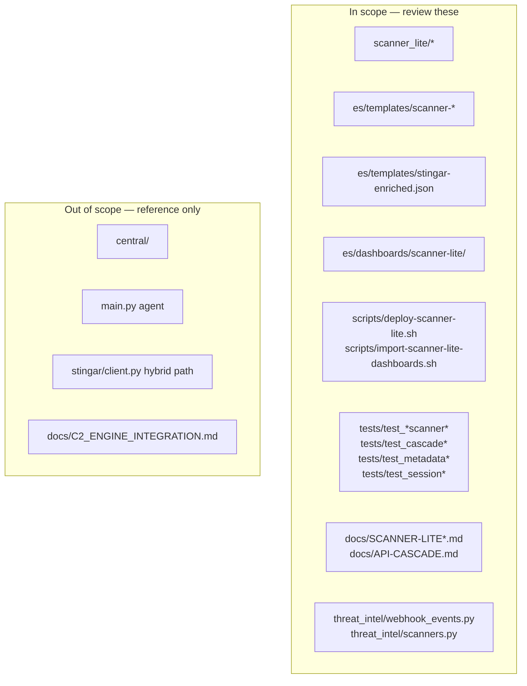
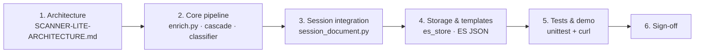
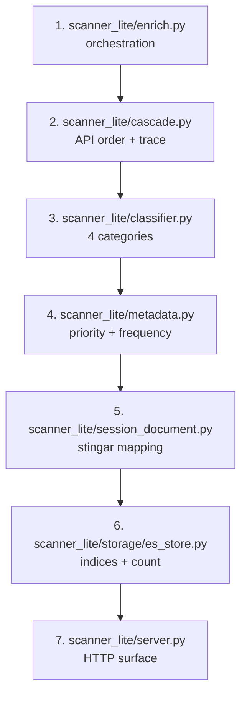
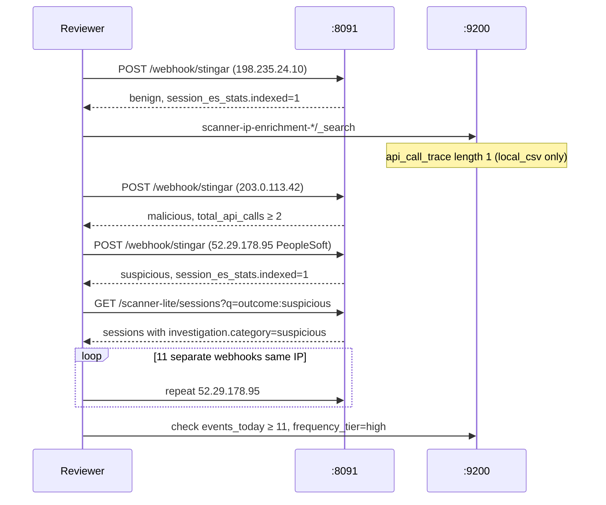

# Code Review Guide — Scanner Enrichment Lite

Reviewer checklist for branch `scanner-enrichment-lite`. Read [SCANNER-LITE-ARCHITECTURE.md](./SCANNER-LITE-ARCHITECTURE.md) first for system context.

## Review scope



This branch delivers **scanner-first enrichment + session integration**. It does not replace the full hybrid platform on `threat-enrich-agent`.

## Review flow



## Checklist by area

### Ingest and API surface

| Check | File(s) | What to verify |
|---|---|---|
| Webhook auth optional | `scanner_lite/server.py` | `STINGAR_WEBHOOK_SECRET` gates `/webhook/stingar` |
| STINGAR payload shapes | `stingar_ingest.py`, `webhook_events.py` | `srcIp`, `hpData`, `app` preserved for metadata |
| Session search exposed | `server.py` | `GET /scanner-lite/sessions` delegates to `document_store` |
| Health reports ES | `server.py`, `es_store.py` | `/health` includes `elasticsearch_reachable` |

### Enrichment pipeline

| Check | File(s) | What to verify |
|---|---|---|
| CSV always first | `cascade.py` | `local_csv` before paid loop |
| Stop conditions | `cascade.py` | Stops on benign/malicious @ confidence ≥ 0.8 |
| Max 3 paid calls | `cascade.py` | `MAX_PAID_CALLS = 3` |
| GreyNoise last | `eval/overlap.py`, `ranking.json` | Policy pinned in overlap eval |
| Honeypot re-classify | `enrich.py`, `classifier.py` | Behavior tags can upgrade to `suspicious` |
| ASN separate path | `asn.py` | Not counted in `api_call_trace` |
| IP history | `es_store.py`, `enrich.py` | `events_today` = ES count + batch occurrence |

### Classifier correctness

| Check | File(s) | What to verify |
|---|---|---|
| Four categories only | `classifier.py` | `benign`, `malicious`, `suspicious`, `unknown` |
| Known scanner → benign | `classifier.py` | CSV match with high/medium confidence |
| PeopleSoft + Go → suspicious | `classifier.py`, `metadata.py` | Rule at lines ~91–93 in classifier |
| Scanner tag shape | `classifier.py` | `build_scanner_tag()` vendor, CIDR, source_url |

### Investigation metadata

| Check | File(s) | What to verify |
|---|---|---|
| Frequency thresholds | `metadata.py` | high ≥ 10, excessive ≥ 30 on `events_today` |
| Priority rules | `metadata.py` | malicious=critical; peoplesoft=high |
| Both event counts | `metadata.py` | `events_in_batch` vs `events_today` distinct |

### Session integration

| Check | File(s) | What to verify |
|---|---|---|
| Dual-write | `enrich.py` | `_index_session_documents()` after enrich batch |
| Field mapping | `session_document.py` | outcome → investigation.category + threat.severity |
| Taxonomy tags | `session_document.py` | `outcome:`, `behavior:`, `scanner:` prefixes |
| Strict template | `stingar-enriched.json` | `hp_data.enrichment.scanner_lite` fields defined |
| Query aliases | `session_query.py` | `outcome`, `priority`, `behavior`, `scanner` |

### Storage and templates

| Check | File(s) | What to verify |
|---|---|---|
| Strict mappings | `es/templates/*.json` | No dynamic field leaks (ASN batch had `scanner_tag` fix) |
| Templates on startup | `es_store.py` | `ensure_templates()` includes stingar-enriched |
| Deploy applies all | `deploy-scanner-lite.sh` | scanner + stingar templates + Kibana import |

### Config and inventory

| Check | File(s) | What to verify |
|---|---|---|
| CSV inventory | `config/scanners/known_scanner_inventory.csv` | Vendor CIDR rows with confidence |
| Feed snapshots | `config/scanners/feeds/*.json` | Large vendors (Stretchoid, hunter, fofa) |
| Cascade ranking | `eval/ranking.json` | abuseipdb → otx → greynoise |

## Key files (read order)



## Test coverage map

| Test file | Covers |
|---|---|
| `tests/test_classifier.py` | 4-category rules |
| `tests/test_cascade.py` | Stop conditions, trace |
| `tests/test_metadata.py` | Behavior tags, frequency, priority |
| `tests/test_session_integration.py` | Session mapping, ES history frequency |
| `tests/test_session_query.py` | Query aliases including `outcome:` |
| `tests/test_stingar_ingest.py` | Webhook payload parsing |
| `tests/test_asn_batches.py` | ASN rollup shape |
| `tests/test_scanner_inventory.py` | CSV + feed registry |

Run:

```bash
python -m venv .venv-demo && .venv-demo/bin/pip install -r requirements.txt
.venv-demo/bin/python -m unittest discover -s tests -p 'test_*.py' -v
```

## Manual verification (demo script)



### Curl commands

```bash
export ELASTICSEARCH_URL=http://127.0.0.1:9200
export STINGAR_STORAGE_BACKEND=elasticsearch
./scripts/deploy-scanner-lite.sh up   # or start ES + server manually

# Benign known scanner (0 paid calls)
curl -X POST http://127.0.0.1:8091/scanner-lite/enrich/events \
  -H "Content-Type: application/json" \
  -d '{"events":[{"source_ip":"198.235.24.10","honeypot_type":"web"}]}'

# Malicious cascade
curl -X POST http://127.0.0.1:8091/scanner-lite/enrich/events \
  -H "Content-Type: application/json" \
  -d '{"events":[{"source_ip":"203.0.113.42","honeypot_type":"cowrie","destination_port":22}]}'

# Suspicious honeypot boost + session write
curl -X POST http://127.0.0.1:8091/webhook/stingar \
  -H "Content-Type: application/json" \
  -d '{"events":[{"app":"peoplesoft","srcIp":"52.29.178.95","hpData":{"method":"HEAD","path":"/ps/signon.html","eventType":"peoplesoft-scan","headers":{"UserAgent":"Go-http-client/1.1"}}}]}'

# Query session records
curl 'http://127.0.0.1:8091/scanner-lite/sessions?q=outcome:suspicious&hours=24'
```

## Common review questions

### Why two Elasticsearch index families?

- **`scanner-ip-enrichment-*`:** Engineering view — `api_call_trace`, raw signals, IP cache, frequency history source.
- **`stingar-enriched-*`:** Analyst view — shared schema with full STINGAR stack, Kibana Attack Analysis, session query API.

Dual-write is intentional until a single index strategy is chosen platform-wide.

### Why doesn't `api_call_trace` include ASN lookups?

ASN resolution (`ripestat`, `ip_api`, `ipinfo`) runs on a **separate path** after classification to avoid conflating reputation APIs with network metadata lookups. See `asn.py` and architecture doc.

### Why is Shodan in the registry but not the cascade?

All eight endpoints participate in **overlap evaluation** (`eval/overlap.py`). Only the top three **classifiers** enter runtime cascade. Shodan is eval-only until ranked into `ranking.json`.

### What would block merge?

- Session writes fail silently (check `session_es_stats.errors`)
- Strict mapping rejections on `stingar-enriched-*` (template not applied)
- Classifier regressions on golden IPs (`eval/golden_ips.json`)
- `events_today` not incrementing across separate webhook calls

## Definition of done (this branch)

- [x] 4-category classifier with CSV-first Tier-0
- [x] 8 endpoint adapters with overlap eval and 3-step cascade
- [x] Investigation metadata (behavior, frequency, priority)
- [x] STINGAR webhook ingest
- [x] Kibana dashboards for scanner-lite indices
- [x] Cross-request IP frequency (`events_today`)
- [x] Dual-write to `stingar-enriched-*` session records
- [x] Session query API with scanner field aliases

## Related documents

| Document | Audience |
|---|---|
| [SCANNER-LITE-ARCHITECTURE.md](./SCANNER-LITE-ARCHITECTURE.md) | Architects, deep dive |
| [SCANNER-LITE.md](./SCANNER-LITE.md) | Operators, quick start |
| [API-CASCADE.md](./API-CASCADE.md) | Endpoint ranking and cost model |
| [ARCHITECTURE.md](./ARCHITECTURE.md) | Full hybrid platform (reference) |
| [C2_ENGINE_INTEGRATION.md](./C2_ENGINE_INTEGRATION.md) | c2-engine porting (separate effort) |
