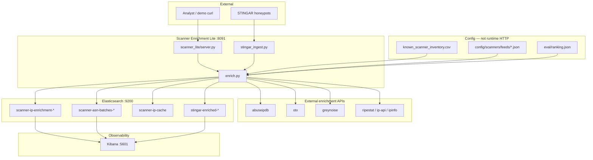
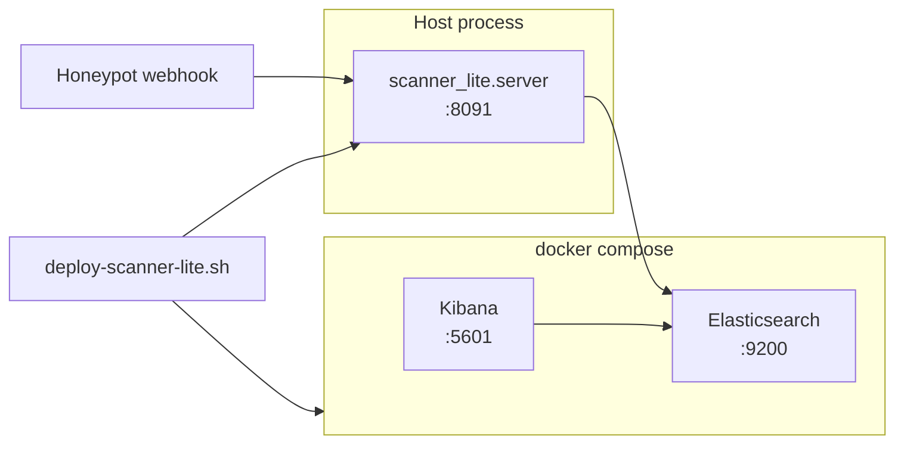
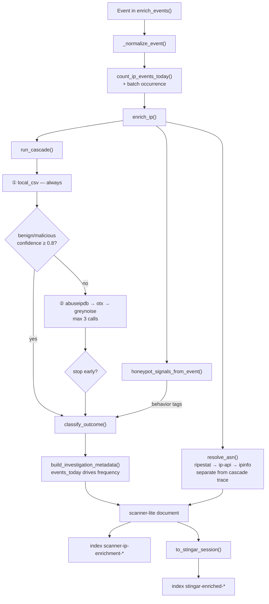
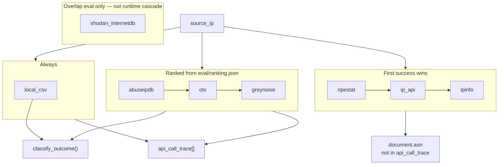
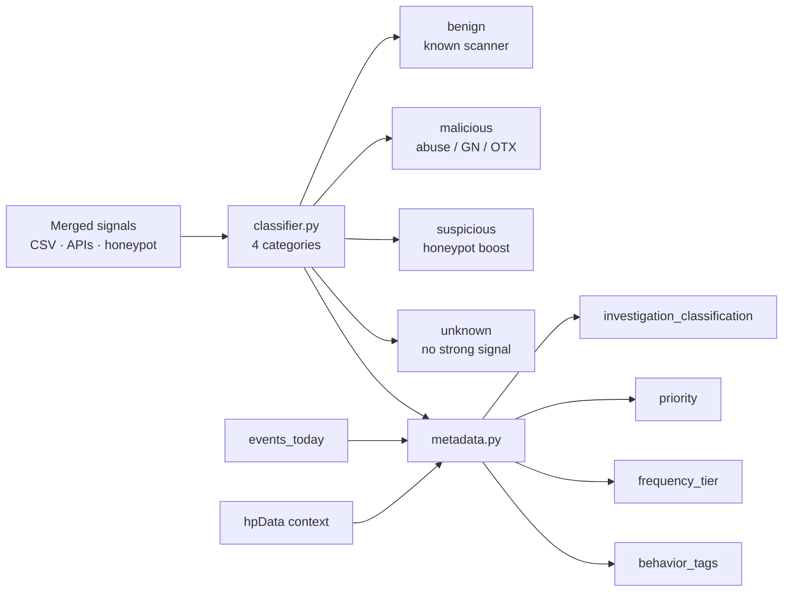
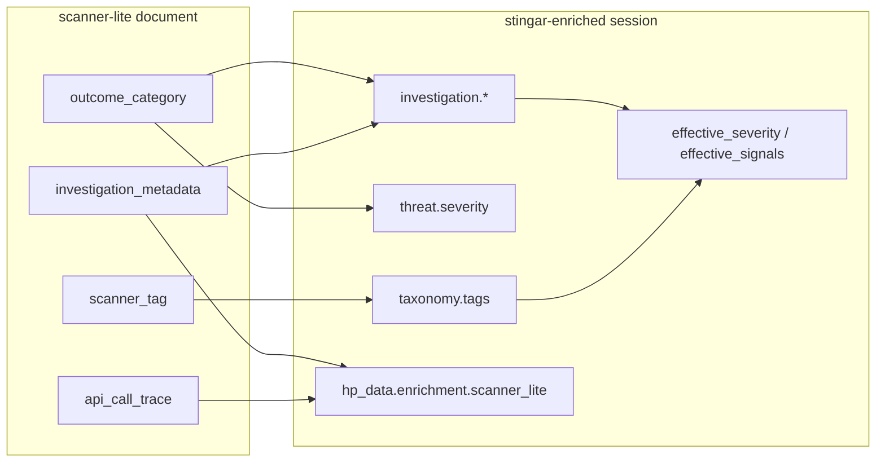
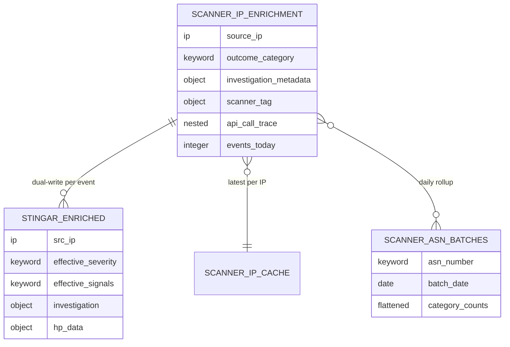
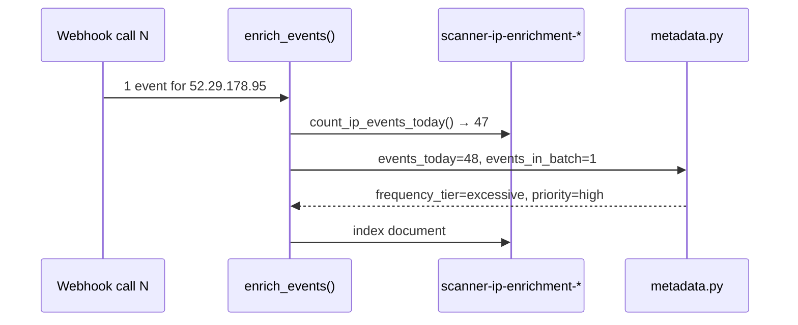
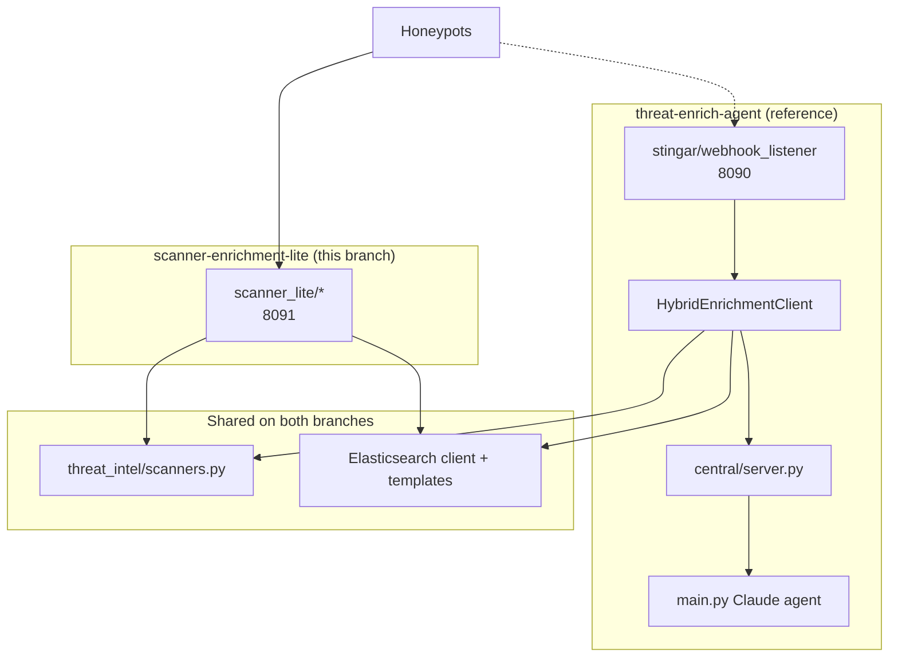

# Scanner Enrichment Lite — Architecture

System design for the `scanner-enrichment-lite` branch. For quick start and API usage see [SCANNER-LITE.md](./SCANNER-LITE.md). For the full hybrid platform see [ARCHITECTURE.md](./ARCHITECTURE.md) and branch `threat-enrich-agent`.

## Problem statement

Honeypot nodes emit high-volume source IPs. Analysts need to know:

1. **Is this a known scanner?** (benign probe traffic vs real threat)
2. **What external APIs were called and why?** (cost control at ~1000 events/day)
3. **What behavior did the honeypot observe?** (PeopleSoft probes, HEAD fingerprinting, etc.)
4. **How often has this IP hit us today?** (frequency-driven priority)

Scanner-lite answers these with a **deterministic 4-category classifier**, **CSV-first Tier-0**, a **3-step paid cascade**, and **dual-write** to both scanner ops indices and analyst session records (`stingar-enriched-*`).

## System context



## Deployment topology



Single-node local demo. No central server, no sync queue, no LLM at runtime.

## Enrichment pipeline (per event)



## Eight endpoints — three roles

Not all eight adapters run on every IP. They have distinct jobs:



| # | Endpoint | Runtime role |
|---|---|---|
| 1 | `local_csv` | Always first; CIDR match against CSV + feed snapshots |
| 2 | `abuseipdb` | Cascade slot 1 |
| 3 | `otx` | Cascade slot 2 |
| 4 | `greynoise` | Cascade slot 3 (intentionally last) |
| 5 | `ripestat` | ASN path |
| 6 | `ip_api` | ASN fallback |
| 7 | `ipinfo` | ASN fallback |
| 8 | `shodan_internetdb` | Eval overlap only today |

## Classifier and metadata



**Priority rules (simplified):**

| Condition | Priority |
|---|---|
| `malicious` | `critical` |
| `benign` + normal frequency | `low` |
| `benign` + high/excessive frequency | `medium` |
| `peoplesoft_probe` or excessive frequency | `high` |
| `suspicious` or high frequency | `medium` |

## Session record integration

Scanner-lite documents are mapped to the shared STINGAR session schema so Attack Analysis and `/scanner-lite/sessions` work against `stingar-enriched-*`.



Mapper: `scanner_lite/session_document.py` → `ElasticsearchDocumentStore.index_documents()`.

## Elasticsearch indices



| Index pattern | Writer | Purpose |
|---|---|---|
| `scanner-ip-enrichment-YYYY-MM-DD` | `ScannerLiteStore` | Ops, trace, frequency history source |
| `scanner-ip-cache` | `ScannerLiteStore` | Latest enrichment per IP (bare `enrich/ip`) |
| `scanner-asn-batches-YYYY-MM-DD` | `ScannerLiteStore` | Daily ASN rollups |
| `stingar-enriched-YYYY-MM-DD` | `ElasticsearchDocumentStore` | Analyst session records |

## Module map

```mermaid
flowchart TB
    subgraph entry [Entry points]
        SERVER["scanner_lite/server.py"]
        DEPLOY["scripts/deploy-scanner-lite.sh"]
    end

    subgraph core [Core pipeline]
        ENRICH["enrich.py"]
        CASCADE["cascade.py"]
        CLASS["classifier.py"]
        META["metadata.py"]
        ASN["asn.py"]
        SESSDOC["session_document.py"]
        INGEST["stingar_ingest.py"]
    end

    subgraph endpoints [scanner_lite/endpoints/"]
        REG["registry.py"]
        LC["local_csv.py"]
        ADAPTERS["abuseipdb · otx · greynoise · ..."]
    end

    subgraph eval [Evaluation]
        OVERLAP["eval/overlap.py"]
        GOLDEN["eval/golden_ips.json"]
        RANKING["eval/ranking.json"]
    end

    subgraph shared [Shared threat_intel/]
        SCANNERS["scanners.py"]
        WEBHOOK["webhook_events.py"]
        ESCLIENT["elasticsearch/client.py"]
        DOCSTORE["elasticsearch/document_store.py"]
        SESSQ["elasticsearch/session_query.py"]
    end

    subgraph storage [Storage]
        STORE["storage/es_store.py"]
    end

    SERVER --> ENRICH
    SERVER --> INGEST
    INGEST --> ENRICH
    ENRICH --> CASCADE
    ENRICH --> CLASS
    ENRICH --> META
    ENRICH --> ASN
    ENRICH --> SESSDOC
    ENRICH --> STORE
    SESSDOC --> DOCSTORE
    CASCADE --> REG
    REG --> LC
    REG --> ADAPTERS
    OVERLAP --> RANKING
    SCANNERS --> LC
    WEBHOOK --> INGEST
```

## Frequency / IP history



Separate webhook calls accumulate. A single batch of 48 events in one payload produces the same `events_today` without 48 HTTP round-trips.

## Relationship to full stack



| Capability | Scanner-lite | Full stack |
|---|---|---|
| Scanner CSV + feeds | Yes | Yes |
| 4-category classifier | Yes | Partial (severity + investigation) |
| API cascade + trace | Yes | Different pipeline |
| Central sync | No | Yes |
| Sharing policy / safelist | No | Yes |
| LLM agent | No | Yes |
| Session records (`stingar-*`) | Yes (dual-write) | Yes |

## Design constraints

1. **Cost-aware:** CSV-first; cascade stops at benign/malicious ≥ 0.8 confidence; max 3 paid calls.
2. **Deterministic:** No LLM at runtime; same signals → same outcome.
3. **Strict ES mappings:** Templates must be applied before index creation (`deploy-scanner-lite.sh`).
4. **Elasticsearch only** for lite storage (not SQLite).

## Related documents

| Document | Content |
|---|---|
| [SCANNER-LITE.md](./SCANNER-LITE.md) | Quick start, API table, demo IPs |
| [API-CASCADE.md](./API-CASCADE.md) | Endpoint eval, ranking, cost model |
| [CODE_REVIEW.md](./CODE_REVIEW.md) | Reviewer checklist and verification |
| [DATA-MODEL.md](./DATA-MODEL.md) | Full-stack schema (shared `stingar-*` conventions) |
| [DECISIONS.md](./DECISIONS.md) | ADRs including CSV + feed snapshots |
