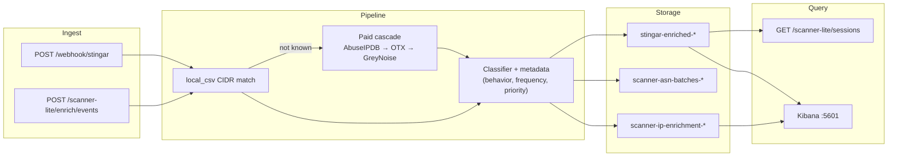

# Scanner Enrichment Lite — End-to-End Demo

Walkthrough for presenting the full scanner-lite project, including **STINGAR webhook ingest**, **cost-aware API cascade**, **ASN batch rollups**, and **enrichment fields written back into `stingar-enriched-*` session records**.

Related docs: [SCANNER-LITE.md](./SCANNER-LITE.md) (quick start), [SCANNER-LITE-ARCHITECTURE.md](./SCANNER-LITE-ARCHITECTURE.md) (design), [CODE_REVIEW.md](./CODE_REVIEW.md) (verification checklist).

---

## What this demo shows

Scanner Enrichment Lite takes honeypot/STINGAR events, enriches source IPs through a cost-aware cascade, classifies them as **benign / malicious / suspicious / unknown**, and stores results in Elasticsearch — including **dual-written session records** in the `stingar-enriched-*` index shape the full STINGAR stack uses.



---

## Prerequisites

| Service | URL | Notes |
|---|---|---|
| Elasticsearch | `http://127.0.0.1:9200` | Docker Compose in `deploy/docker-compose.yml` |
| Redis | `redis://127.0.0.1:6379/0` | Scanner inventory hot store (Docker `redis:7` service) |
| Scanner-lite API | `http://127.0.0.1:8091` | `python -m scanner_lite.server` |
| Kibana | `http://127.0.0.1:5601` | Optional; dashboard import via script |

### Start the full stack

**Docker path** (needs Docker Desktop + several GB free disk):

```bash
# Ensure Docker Desktop is running first
open -a Docker

export ELASTICSEARCH_URL=http://127.0.0.1:9200
export STINGAR_STORAGE_BACKEND=elasticsearch
export REDIS_URL=redis://127.0.0.1:6379/0
export SCANNER_INVENTORY_BACKEND=redis

# One command: ES + Redis + templates + seed + API + sample events + Kibana dashboards
PYTHON=.venv-demo/bin/python ./scripts/deploy-scanner-lite.sh up
```

**Seed inventory manually** (if Redis is up but empty):

```bash
export REDIS_URL=redis://127.0.0.1:6379/0
python scripts/seed-scanner-redis.py
curl "http://127.0.0.1:9200/scanner-inventory-$(date +%Y-%m-%d)/_count"
curl http://127.0.0.1:8091/scanner-lite/inventory/meta
```

**No Docker path** (use when Docker won't open — usually disk is full):

```bash
export ELASTICSEARCH_URL=http://127.0.0.1:9200
export STINGAR_STORAGE_BACKEND=elasticsearch

# Homebrew Elasticsearch, 512MB heap — no Docker/Kibana required for API demo
PYTHON=.venv-demo/bin/python ./scripts/deploy-scanner-lite.sh up-native
```

Or step by step:

```bash
./scripts/start-elasticsearch-native.sh
PYTHON=.venv-demo/bin/python ./scripts/deploy-scanner-lite.sh es-native
.venv-demo/bin/python -m scanner_lite.server   # separate terminal if not started by up-native
```

Or manually (Docker):

```bash
docker compose -f deploy/docker-compose.yml up -d elasticsearch kibana
export ELASTICSEARCH_URL=http://127.0.0.1:9200
export STINGAR_STORAGE_BACKEND=elasticsearch
.venv-demo/bin/python -m scanner_lite.server   # separate terminal
./scripts/import-scanner-lite-dashboards.sh
```

### Health check

```bash
curl -s http://127.0.0.1:8091/health | python3 -m json.tool
```

Expected when ES is up:

```json
{
  "status": "ok",
  "service": "scanner-enrichment-lite",
  "storage": "elasticsearch",
  "elasticsearch_reachable": true,
  "ip_index_prefix": "scanner-ip-enrichment",
  "asn_index_prefix": "scanner-asn-batches"
}
```

If `elasticsearch_reachable` is `false`, enrichment still runs but ES writes and session search will fail until Docker/ES is healthy.

---

## Demo IPs (one slide)

| IP | Story | Outcome | Paid API calls | Session highlights |
|---|---|---|---|---|
| `198.235.24.10` | Palo Alto Xpanse CSV match | benign | 0 | `investigation.category=benign`, scanner tag |
| `203.0.113.42` | AbuseIPDB cascade (SSH brute-force) | malicious | 1+ | `threat.severity=HIGH` |
| `52.29.178.95` | PeopleSoft HEAD + Go-http-client webhook | suspicious | ~4 (full cascade) | `priority=high`, behavior tags, `hp_data.enrichment.scanner_lite` |

---

## Step 1 — Benign known scanner (zero paid API calls)

**IP:** `198.235.24.10` — Palo Alto Cortex Xpanse in local CSV.

```bash
curl -s -X POST http://127.0.0.1:8091/scanner-lite/enrich/events \
  -H "Content-Type: application/json" \
  -d '{"events":[{"source_ip":"198.235.24.10","honeypot_type":"web"}]}' \
  | python3 -m json.tool
```

**What to highlight:**

| Field | Expected value |
|---|---|
| `outcome_category` | `benign` |
| `investigation_metadata.investigation_classification` | `known_scanner` |
| `investigation_metadata.priority` | `low` |
| `api_call_trace` | Single entry: `local_csv` (cost $0) |
| `session_es_stats.indexed` | `1` (when ES is up) |

**Why it matters:** The CSV tier resolves most scanner traffic for free before any paid lookup.

Sample key fields:

```json
{
  "source_ip": "198.235.24.10",
  "outcome_category": "benign",
  "outcome_reasons": [
    "Known scanner: Palo Alto Networks Cortex Xpanse (198.235.24.0/24)"
  ],
  "investigation_metadata": {
    "investigation_classification": "known_scanner",
    "scanner_attribution": "known:Palo Alto Networks Cortex Xpanse",
    "priority": "low",
    "frequency_tier": "normal"
  },
  "scanner_tag": {
    "vendor": "Palo Alto Networks Cortex Xpanse",
    "scanner_id": "palo-alto-networks-cortex-xpanse",
    "matched_cidr": "198.235.24.0/24"
  }
}
```

---

## Step 2 — Malicious IP (cascade kicks in)

**IP:** `203.0.113.42` — SSH brute-force on Cowrie honeypot.

```bash
curl -s -X POST http://127.0.0.1:8091/scanner-lite/enrich/events \
  -H "Content-Type: application/json" \
  -d '{"events":[{"source_ip":"203.0.113.42","honeypot_type":"cowrie","destination_port":22}]}' \
  | python3 -m json.tool
```

**What to highlight:**

| Field | Expected value |
|---|---|
| `outcome_category` | `malicious` |
| `api_call_trace` | `local_csv` → `abuseipdb` (stops when decisive) |
| `total_api_calls` | 2 |
| AbuseIPDB result | High abuse confidence score |

Cascade stops early — it does not burn calls on OTX/GreyNoise when the first paid source is decisive.

---

## Step 3 — STINGAR webhook (production ingest path)

**IP:** `52.29.178.95` — PeopleSoft HEAD probe, `Go-http-client/1.1`.

```bash
curl -s -X POST http://127.0.0.1:8091/webhook/stingar \
  -H "Content-Type: application/json" \
  -d '{
    "events": [{
      "app": "peoplesoft",
      "srcIp": "52.29.178.95",
      "hpData": {
        "method": "HEAD",
        "path": "/ps/signon.html",
        "eventType": "peoplesoft-scan",
        "headers": {"UserAgent": "Go-http-client/1.1"}
      }
    }]
  }' | python3 -m json.tool
```

If `STINGAR_WEBHOOK_SECRET` is set, add: `-H "X-Webhook-Secret: $STINGAR_WEBHOOK_SECRET"`.

**Expected response shape:**

```json
{
  "status": "accepted",
  "service": "scanner-enrichment-lite",
  "received_events": 1,
  "enriched_count": 1,
  "category_counts": { "suspicious": 1 },
  "total_api_calls": 4,
  "es_stats": {
    "indexed": 1,
    "index": "scanner-asn-batches-YYYY-MM-DD"
  },
  "session_es_stats": {
    "indexed": 1,
    "failed": 0
  }
}
```

**Behavior tags detected:** `peoplesoft_probe`, `head_fingerprint`, `go_http_client`, `application_layer_recon`.

**Flow:** STINGAR webhook JSON → `process_stingar_payload()` → `enrich_events()` → dual-write to lite indices + `stingar-enriched-*`.

---

## Step 4 — Session integration (enrichment → Elastic session records)

Each enriched event is **dual-written**:

| Index | Purpose |
|---|---|
| `scanner-ip-enrichment-*` | Ops view: `api_call_trace`, IP cache, frequency history |
| `scanner-asn-batches-*` | Daily ASN rollups |
| `stingar-enriched-*` | Analyst session records — `investigation.*`, `taxonomy.tags`, `hp_data.enrichment.scanner_lite` |

### Field mapping

| Scanner-lite field | Session record field |
|---|---|
| `outcome_category` | `investigation.category` |
| `investigation_metadata.*` | `investigation.*` |
| behavior/scanner tags | `taxonomy.tags` |
| full lite payload | `hp_data.enrichment.scanner_lite` |
| outcome → severity | `threat.severity` (HIGH / MEDIUM / LOW) |

Mapper: `scanner_lite/session_document.py` (`to_stingar_session`).

Dual-write trigger: `scanner_lite/enrich.py` — every `enrich_events()` call indexes session docs when `index_sessions=True` (default).

### Preview session document (no ES required)

```bash
.venv-demo/bin/python << 'PY'
import json
from scanner_lite.enrich import enrich_ip
from scanner_lite.session_document import to_stingar_session

event = {
    "app": "peoplesoft",
    "srcIp": "52.29.178.95",
    "hpData": {
        "method": "HEAD",
        "path": "/ps/signon.html",
        "eventType": "peoplesoft-scan",
        "headers": {"UserAgent": "Go-http-client/1.1"},
    },
}
doc = enrich_ip("52.29.178.95", event=event, events_in_batch=1, events_today=1)
session = to_stingar_session(doc, event, client_id="scanner-lite")
print(json.dumps({
    "index": "stingar-enriched-YYYY-MM-DD",
    "src_ip": session["src_ip"],
    "investigation": session["investigation"],
    "threat.severity": session["threat"]["severity"],
    "taxonomy.tags": session["taxonomy"]["tags"],
    "hp_data.enrichment.scanner_lite": session["hp_data"]["enrichment"]["scanner_lite"],
    "elastic_metadata.pipeline": session["elastic_metadata"]["pipeline"],
}, indent=2))
PY
```

**Example output:**

```json
{
  "src_ip": "52.29.178.95",
  "investigation": {
    "classification": "active_application_recon",
    "category": "suspicious",
    "priority": "high",
    "reasons": [
      "Targeted PeopleSoft fingerprinting from unbranded Go HTTP client."
    ]
  },
  "threat.severity": "MEDIUM",
  "taxonomy.tags": [
    "attribution:unidentified_go_scanner",
    "behavior:application_layer_recon",
    "behavior:go_http_client",
    "behavior:head_fingerprint",
    "behavior:peoplesoft_probe",
    "outcome:suspicious"
  ],
  "hp_data.enrichment.scanner_lite": {
    "outcome_category": "suspicious",
    "outcome_confidence": 0.82,
    "scanner_attribution": "unidentified_go_scanner",
    "frequency_tier": "normal",
    "events_today": 1,
    "events_in_batch": 1,
    "behavior_tags": [
      "peoplesoft_probe",
      "head_fingerprint",
      "go_http_client",
      "application_layer_recon"
    ],
    "api_calls": 4
  },
  "elastic_metadata.pipeline": "scanner-enrichment-lite"
}
```

### Cross-request frequency (`events_today`)

`events_today` = Elasticsearch docs already indexed for that IP today **plus** the current batch. This drives `frequency_tier` and `priority` across separate webhook calls (not just within one HTTP payload).

Thresholds: `high` ≥ 10 events/IP today, `excessive` ≥ 30.

**Frequency demo:** Send the PeopleSoft webhook 11 times for `52.29.178.95`, then verify `events_today ≥ 11` and `frequency_tier=high` in the session doc.

---

## Step 5 — Session search API

Query enriched sessions (same index as full STINGAR stack):

```bash
curl -s 'http://127.0.0.1:8091/scanner-lite/sessions?q=outcome:suspicious&hours=24' \
  | python3 -m json.tool

curl -s 'http://127.0.0.1:8091/scanner-lite/sessions?q=priority:high&hours=24' \
  | python3 -m json.tool

curl -s 'http://127.0.0.1:8091/scanner-lite/sessions?q=priority:high%20src_ip:52.29.178.95' \
  | python3 -m json.tool
```

**Query aliases for scanner-lite fields:** `outcome`, `category`, `priority`, `behavior`, `scanner`, plus existing `severity`, `signal`, `verdict`, `src_ip`, `honeypot`.

---

## Step 6 — Verify directly in Elasticsearch

```bash
curl -s "http://127.0.0.1:9200/stingar-enriched-$(date +%Y-%m-%d)/_search?pretty" \
  -H 'Content-Type: application/json' \
  -d '{
    "size": 2,
    "sort": [{"@timestamp": "desc"}],
    "_source": [
      "src_ip",
      "investigation",
      "effective_severity",
      "hp_data.enrichment.scanner_lite",
      "taxonomy.tags"
    ]
  }'
```

Lite enrichment index:

```bash
curl -s "http://127.0.0.1:9200/scanner-ip-enrichment-$(date +%Y-%m-%d)/_search?pretty" \
  -H 'Content-Type: application/json' \
  -d '{"size": 1, "_source": ["source_ip", "outcome_category", "api_call_trace"]}'
```

---

## Step 7 — ASN daily batches

```bash
curl -s "http://127.0.0.1:8091/scanner-lite/batches/asn?date=$(date +%Y-%m-%d)" \
  | python3 -m json.tool
```

Rolls up enriched events by ASN for daily “which ASNs are scanning us?” analysis. Index: `scanner-asn-batches-YYYY-MM-DD`.

---

## Step 8 — Kibana dashboards

After deploy:

- **URL:** `http://127.0.0.1:5601/app/dashboards#/view/scanner-lite-dashboard`
- **NDJSON:** `es/dashboards/scanner-lite/scanner-lite.ndjson`
- **Re-import:** `./scripts/import-scanner-lite-dashboards.sh`

| View | Index pattern | Purpose |
|---|---|---|
| Scanner Enrichment Lite dashboard | `scanner-ip-enrichment-*`, `scanner-asn-batches-*` | IP outcomes + ASN rollups |
| IP enrichment table | `scanner-ip-enrichment-*` | Outcomes, scanner tags, metadata |
| ASN batches table | `scanner-asn-batches-*` | Daily ASN counts by category |

---

## Full demo script (copy-paste)

```bash
export ELASTICSEARCH_URL=http://127.0.0.1:9200
export STINGAR_STORAGE_BACKEND=elasticsearch

echo "=== 1. HEALTH ==="
curl -s http://127.0.0.1:8091/health | python3 -m json.tool

echo "=== 2. BENIGN ==="
curl -s -X POST http://127.0.0.1:8091/scanner-lite/enrich/events \
  -H "Content-Type: application/json" \
  -d '{"events":[{"source_ip":"198.235.24.10","honeypot_type":"web"}]}' \
  | python3 -m json.tool

echo "=== 3. MALICIOUS ==="
curl -s -X POST http://127.0.0.1:8091/scanner-lite/enrich/events \
  -H "Content-Type: application/json" \
  -d '{"events":[{"source_ip":"203.0.113.42","honeypot_type":"cowrie","destination_port":22}]}' \
  | python3 -m json.tool

echo "=== 4. STINGAR WEBHOOK ==="
curl -s -X POST http://127.0.0.1:8091/webhook/stingar \
  -H "Content-Type: application/json" \
  -d '{"events":[{"app":"peoplesoft","srcIp":"52.29.178.95","hpData":{"method":"HEAD","path":"/ps/signon.html","eventType":"peoplesoft-scan","headers":{"UserAgent":"Go-http-client/1.1"}}}]}' \
  | python3 -m json.tool

echo "=== 5. ASN BATCHES ==="
curl -s "http://127.0.0.1:8091/scanner-lite/batches/asn?date=$(date +%Y-%m-%d)" \
  | python3 -m json.tool

echo "=== 6. SESSION SEARCH ==="
curl -s 'http://127.0.0.1:8091/scanner-lite/sessions?q=outcome:suspicious&hours=24' \
  | python3 -m json.tool

echo "=== 7. ES SESSION VERIFY ==="
curl -s "http://127.0.0.1:9200/stingar-enriched-$(date +%Y-%m-%d)/_search?pretty" \
  -H 'Content-Type: application/json' \
  -d '{"size":2,"sort":[{"@timestamp":"desc"}],"_source":["src_ip","investigation","hp_data.enrichment.scanner_lite","taxonomy.tags"]}'
```

---

## Unit tests (no Elasticsearch required)

```bash
.venv-demo/bin/python -m unittest \
  tests.test_session_integration \
  tests.test_session_query \
  tests.test_classifier \
  tests.test_cascade \
  tests.test_stingar_ingest \
  -v
```

Session integration tests cover:

- `to_stingar_session` field mapping (`investigation.category`, `hp_data.enrichment.scanner_lite`)
- `events_today` driving frequency (not batch-only counts)
- Session query aliases (`outcome:`, `priority:`)

---

## Troubleshooting

| Symptom | Cause | Fix |
|---|---|---|
| Docker won't open / hangs at "Starting Docker..." | **Disk nearly full** — Docker logs show `FILE_ERROR_NO_SPACE` | Free **5–10 GB** (Empty Trash, large `~/Library/Caches`, unused apps). Check: `df -h /System/Volumes/Data` |
| `curl: Connection refused` on `:8091` | API not running | `.venv-demo/bin/python -m scanner_lite.server` |
| `elasticsearch_reachable: false` | ES down | `./scripts/start-elasticsearch-native.sh` or fix Docker then `./scripts/deploy-scanner-lite.sh up` |
| Docker broken but demo needed now | Docker requires disk Docker can't use | `./scripts/deploy-scanner-lite.sh up-native` |
| `session_es_stats.indexed: 0` with ES errors | ES unreachable or template missing | Start ES; run `es-native` or `up-native` |
| `/scanner-lite/sessions` returns 502 | ES down or index empty | Fix ES; run webhook/enrich steps first |
| `/scanner-lite/sessions` returns 404 | Old server process | Restart server from current branch code |
| Deploy script hangs on Docker | Waiting for daemon | Use `up-native` or free disk and restart Docker Desktop |
| ES keystore EOF error (Docker) | Corrupted volume | `docker compose -f deploy/docker-compose.yml down -v` then recreate |
| `could not find java in bundled JDK` (brew ES) | Incomplete elasticsearch-full install | `start-elasticsearch-native.sh` sets `ES_JAVA_HOME` automatically |

---

## Definition of done (this branch)

- [x] 4-category classifier with CSV-first Tier-0
- [x] 8 endpoint adapters with overlap eval and 3-step cascade
- [x] Investigation metadata (behavior, frequency, priority)
- [x] STINGAR webhook ingest
- [x] Kibana dashboards for scanner-lite indices
- [x] Cross-request IP frequency (`events_today`)
- [x] Dual-write to `stingar-enriched-*` session records
- [x] Session query API with scanner field aliases

**Live proof:** After a successful demo run with ES up, every enrich/webhook response should show `session_es_stats.indexed: 1`, and `/scanner-lite/sessions?q=outcome:suspicious` should return hits with `investigation.category=suspicious` and `hp_data.enrichment.scanner_lite` populated.
