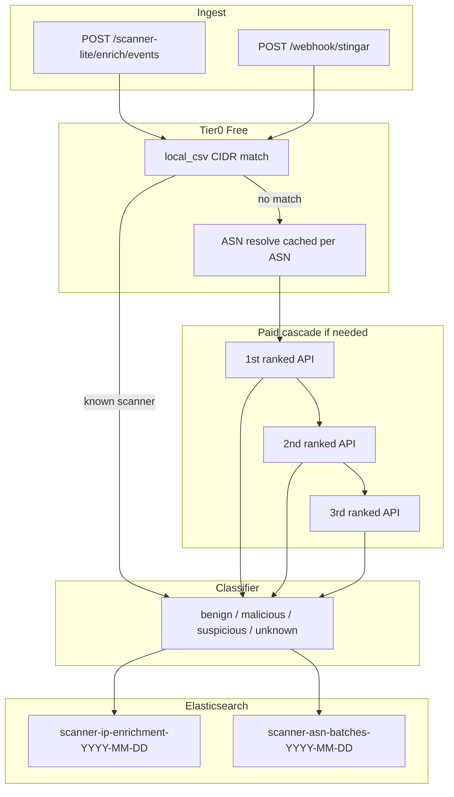
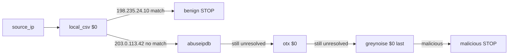

# Scanner Enrichment Lite

Simplified scanner-first enrichment on the `scanner-enrichment-lite` branch.

Full hybrid architecture: see [REFERENCE.md](../REFERENCE.md) and branch `threat-enrich-agent`.

## What this does

- Tags known scanners from [known_scanner_inventory.csv](../config/scanners/known_scanner_inventory.csv) and feed snapshots under `config/scanners/feeds/`
- Classifies each IP into **benign**, **malicious**, **suspicious**, or **unknown**
- Attaches **investigation metadata** (behavior tags, frequency tier, priority) alongside the 4-category outcome
- Runs a **cost-aware API cascade** (1st / 2nd / 3rd best after eval)
- Stores per-IP enrichment in **Elasticsearch** with `api_call_trace`
- Rolls up daily **ASN batches** for ~1000 events/day analysis

No central sync, no sharing policy, no LLM at runtime.

## Architecture



## Per-IP API call diagram



Each enriched document stores `api_call_trace[]` showing exactly which endpoints fired.

## Investigation metadata

The 4-category `outcome_category` answers **hostility**. A sibling `investigation_metadata` object adds context without a fifth bucket:

| Field | Example | Purpose |
|---|---|---|
| `investigation_classification` | `active_application_recon` | Analyst workflow subclass |
| `scanner_attribution` | `unidentified_go_scanner` | Known vendor or unidentified tool family |
| `behavior_tags` | `peoplesoft_probe`, `go_http_client` | Honeypot-derived behavior signals |
| `frequency_tier` | `normal` / `high` / `excessive` | Event volume for this IP in the batch |
| `priority` | `low` / `medium` / `high` / `critical` | Analyst attention level |
| `events_in_batch` | `48` | Raw count for this IP in the current HTTP payload |
| `events_today` | `48` | Total events for this IP today (ES history + current batch) |

Frequency thresholds: `high` ≥ 10 events/IP **today**, `excessive` ≥ 30. Counts come from **`events_today`** — Elasticsearch docs already indexed for that IP today plus the current batch — not just the current HTTP payload. The batch-only count is still stored as `events_in_batch`.

Honeypot fields (`hpData`, `srcIp`, `app`) boost classification — e.g. PeopleSoft HEAD probes with `Go-http-client/1.1` become `suspicious` even when IP APIs return `unknown`.

## Session record integration

Each enriched event is **dual-written**:

| Index | Purpose |
|---|---|
| `scanner-ip-enrichment-*` | Scanner-lite ops view, `api_call_trace`, IP cache |
| `stingar-enriched-*` | Analyst session records — `investigation.*`, `effective_severity`, `taxonomy.tags`, `hp_data.enrichment.scanner_lite` |

The session mapper lives in `scanner_lite/session_document.py`. Webhook and batch ingest return `session_es_stats` alongside `es_stats`.

Query enriched sessions (same index as full STINGAR stack):

```bash
curl 'http://127.0.0.1:8091/scanner-lite/sessions?q=outcome:suspicious&hours=24'
curl 'http://127.0.0.1:8091/scanner-lite/sessions?q=priority:high%20src_ip:52.29.178.95'
```

Session query aliases for scanner-lite fields: `outcome`, `category`, `priority`, `behavior`, `scanner`, plus existing `severity`, `signal`, `verdict`, `src_ip`, `honeypot`.

## Quick start

```bash
export STINGAR_STORAGE_BACKEND=elasticsearch
export ELASTICSEARCH_URL=http://127.0.0.1:9200

./scripts/deploy-scanner-lite.sh up
```

This starts Elasticsearch, Kibana (`:5601`), the scanner-lite API (`:8091`), loads demo events, and imports the **Scanner Enrichment Lite** dashboard.

Or manually:

```bash
docker compose -f deploy/docker-compose.yml up -d elasticsearch kibana
.venv-1/bin/python -m scanner_lite.server
./scripts/import-scanner-lite-dashboards.sh
```

## STINGAR webhook ingest

Point honeypot nodes at the scanner-lite server instead of the full hybrid listener when you only need scanner classification + ES storage:

```bash
# Same payload shapes as stingar/webhook_listener.py
curl -X POST http://127.0.0.1:8091/webhook/stingar \
  -H "Content-Type: application/json" \
  -H "X-Webhook-Secret: $STINGAR_WEBHOOK_SECRET" \
  -d '{
    "events": [
      {
        "app": "peoplesoft",
        "srcIp": "52.29.178.95",
        "dstIp": "150.136.255.191",
        "dstPort": 8000,
        "hpData": {
          "method": "HEAD",
          "path": "/ps/signon.html",
          "eventType": "peoplesoft-scan",
          "headers": {"UserAgent": "Go-http-client/1.1"}
        }
      }
    ]
  }'
```

Environment variables (shared with full STINGAR stack):

| Variable | Default | Purpose |
|---|---|---|
| `STINGAR_CLIENT_ID` | `scanner-lite` | Client id passed to enrichment |
| `STINGAR_SENSOR_ID` | — | Default sensor id when events omit it |
| `STINGAR_WEBHOOK_SECRET` | — | If set, require `X-Webhook-Secret` header |

Native STINGAR fields (`srcIp`, `hpData`, `app`) are preserved so honeypot behavior tags and PeopleSoft probes classify correctly.

## Kibana dashboards

Importable saved objects live in [es/dashboards/scanner-lite/scanner-lite.ndjson](../es/dashboards/scanner-lite/scanner-lite.ndjson).

| View | Index pattern | Purpose |
|---|---|---|
| **Scanner Enrichment Lite** dashboard | `scanner-ip-enrichment-*`, `scanner-asn-batches-*` | IP outcomes + ASN batch rollups |
| IP enrichment table | `scanner-ip-enrichment-*` | `source_ip`, `outcome_category`, `scanner_tag.vendor`, `investigation_metadata.*` |
| ASN batches table | `scanner-asn-batches-*` | Daily ASN counts by outcome category |

After deploy, open: `http://127.0.0.1:5601/app/dashboards#/view/scanner-lite-dashboard`

Re-import anytime: `./scripts/import-scanner-lite-dashboards.sh` or `./scripts/deploy-scanner-lite.sh dashboards`

## API endpoints

| Method | Path | Description |
|---|---|---|
| GET | `/health` | ES reachability |
| POST | `/scanner-lite/enrich/ip` | Single IP enrichment |
| POST | `/scanner-lite/enrich/events` | Batch honeypot events |
| POST | `/webhook/stingar` | STINGAR webhook (single or wrapped batch) |
| POST | `/webhook/stingar/batch` | Alias for `/webhook/stingar` |
| GET | `/scanner-lite/batches/asn?date=YYYY-MM-DD` | ASN batch rollups |
| GET | `/scanner-lite/sessions?q=...&hours=24` | Search `stingar-enriched-*` session records |
| GET | `/scanner-lite/eval/ranking` | Current cascade ranking |
| POST | `/scanner-lite/eval/run` | Re-run overlap eval |

## Demo expectations

| IP | Expected | Paid API calls |
|---|---|---|
| `198.235.24.10` | benign + scanner tag | 0 |
| `203.0.113.42` | malicious or suspicious | 1+ |

## Storage

Elasticsearch only (not SQLite). Indices:

- `scanner-ip-enrichment-*` — per-event enrichment + `api_call_trace` + `investigation_metadata`
- `scanner-ip-cache` — latest enrichment per source IP
- `scanner-asn-batches-*` — daily ASN rollups

See [API-CASCADE.md](API-CASCADE.md) for endpoint evaluation details.
