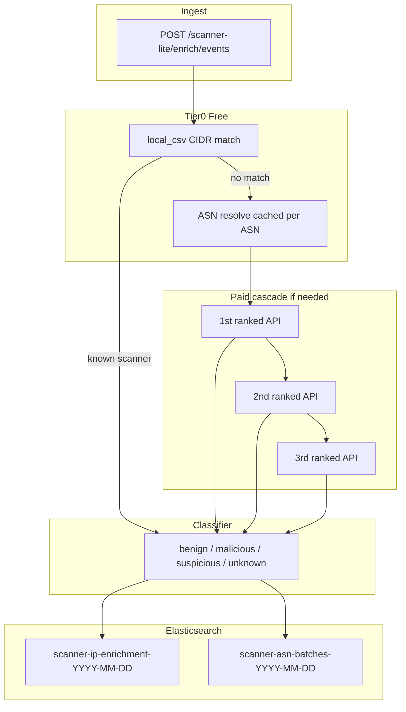
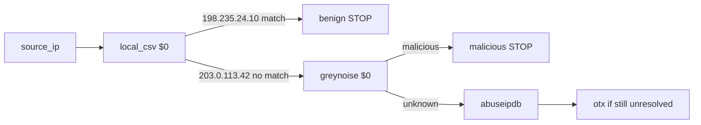

# Scanner Enrichment Lite

Simplified scanner-first enrichment on the `scanner-enrichment-lite` branch.

Full hybrid architecture: see [REFERENCE.md](../REFERENCE.md) and branch `threat-enrich-agent`.

## What this does

- Tags known scanners from [known_scanner_inventory.csv](../config/scanners/known_scanner_inventory.csv)
- Classifies each IP into **benign**, **malicious**, **suspicious**, or **unknown**
- Runs a **cost-aware API cascade** (1st / 2nd / 3rd best after eval)
- Stores per-IP enrichment in **Elasticsearch** with `api_call_trace`
- Rolls up daily **ASN batches** for ~1000 events/day analysis

No central sync, no sharing policy, no LLM at runtime.

## Architecture



## Per-IP API call diagram



Each enriched document stores `api_call_trace[]` showing exactly which endpoints fired.

## Quick start

```bash
export STINGAR_STORAGE_BACKEND=elasticsearch
export ELASTICSEARCH_URL=http://127.0.0.1:9200

./scripts/deploy-scanner-lite.sh up
```

Or manually:

```bash
docker compose -f deploy/docker-compose.yml up -d elasticsearch
.venv-1/bin/python -m scanner_lite.server
```

## API endpoints

| Method | Path | Description |
|---|---|---|
| GET | `/health` | ES reachability |
| POST | `/scanner-lite/enrich/ip` | Single IP enrichment |
| POST | `/scanner-lite/enrich/events` | Batch honeypot events |
| GET | `/scanner-lite/batches/asn?date=YYYY-MM-DD` | ASN batch rollups |
| GET | `/scanner-lite/eval/ranking` | Current cascade ranking |
| POST | `/scanner-lite/eval/run` | Re-run overlap eval |

## Demo expectations

| IP | Expected | Paid API calls |
|---|---|---|
| `198.235.24.10` | benign + scanner tag | 0 |
| `203.0.113.42` | malicious or suspicious | 1+ |

## Storage

Elasticsearch only (not SQLite). Indices:

- `scanner-ip-enrichment-*` — per-event enrichment + `api_call_trace`
- `scanner-ip-cache` — latest enrichment per source IP
- `scanner-asn-batches-*` — daily ASN rollups

See [API-CASCADE.md](API-CASCADE.md) for endpoint evaluation details.
