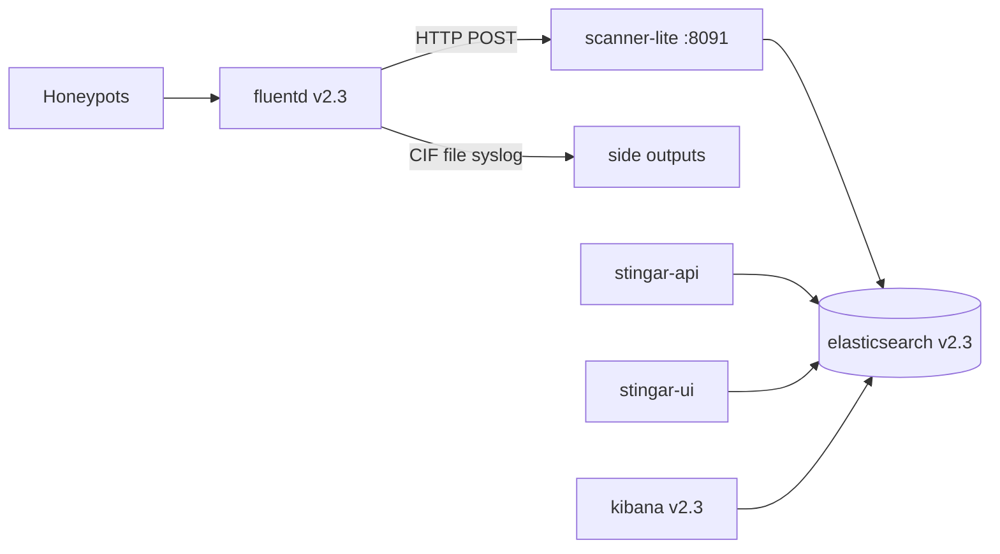

# STINGAR stack integration

Connect scanner-lite enrichment to a production **STINGAR v2.3** docker-compose stack (`4warned/*` images) with shared Elasticsearch, Redis, Fluentd, and Kibana.

## Architecture



Fluentd tag **`stingar.events.*`** is forwarded to scanner-lite via HTTP (`POST /ingest/fluentd`).
scanner-lite enriches and upserts session documents to `stingar-YYYY-MM-DD` (Fluentd no longer writes events directly to ES).

Each session document includes:

- `outcome_category` — primary Attack Analysis column (`benign` / `malicious` / `suspicious` / `unknown`)
- `outcome_summary` — compact metadata for drilldown/hover
- `investigation.*` and `hp_data.enrichment.scanner_lite.*` — full analyst context

## Deploy layout

| Path | Purpose |
|------|---------|
| [`deploy/stingar/docker-compose.yml`](../deploy/stingar/docker-compose.yml) | Full stack: stock STINGAR + scanner-lite + patched fluentd |
| [`deploy/stingar/scanner-lite.overlay.yml`](../deploy/stingar/scanner-lite.overlay.yml) | Drop-in overlay for existing STINGAR installs |
| [`deploy/stingar/fluentd.conf`](../deploy/stingar/fluentd.conf) | Patched fluentd (inline enrichment path) |
| [`deploy/stingar/base/`](../deploy/stingar/base/) | Stock STINGAR reference (unmodified) |
| [`vendor/stingar-ui/`](../vendor/stingar-ui/) | Extracted UI source + outcome column patch |
| [`vendor/stingar-api/`](../vendor/stingar-api/) | Extracted API source (`apiarist` package) |
| [`scripts/extract-stingar-images.sh`](../scripts/extract-stingar-images.sh) | Refresh vendor trees from `4warned/*:v2.3` |

See [`deploy/stingar/README.md`](../deploy/stingar/README.md) for step-by-step commands.

## Quick start

### Full docker-compose stack

```bash
cd deploy/stingar
cp base/stingar.env.example stingar.env   # configure CHANGEME values
# merge scanner-lite vars from deploy/stingar/stingar.env.example
mkdir -p storage/db certs

docker compose up -d --build
../../scripts/deploy-stingar-integration.sh templates
../../scripts/deploy-stingar-integration.sh seed-redis
../../scripts/deploy-stingar-integration.sh smoke
```

### Overlay on existing STINGAR

```bash
cp /path/to/threat-intel-agent-lite/deploy/stingar/fluentd.conf ./fluentd.conf

export SCANNER_LITE_BUILD_CONTEXT=/path/to/threat-intel-agent-lite
docker compose \
  -f docker-compose.yml \
  -f /path/to/threat-intel-agent-lite/deploy/stingar/scanner-lite.overlay.yml \
  up -d scanner-lite fluentd
```

### Native scanner-lite (dev)

```bash
export ELASTICSEARCH_URL=http://127.0.0.1:9200
export REDIS_URL=redis://127.0.0.1:6379/0
export SCANNER_INVENTORY_BACKEND=redis

./scripts/deploy-stingar-integration.sh up
```

## Kibana Attack Analysis dashboard

```bash
export KIBANA_URL=http://127.0.0.1:5601
./scripts/import-stingar-dashboards.sh
```

Open: `http://127.0.0.1:5601/app/dashboards#/view/stingar-attack-analysis-dashboard`

## Ingest endpoints

| Endpoint | Source | Auth |
|----------|--------|------|
| `POST /webhook/stingar` | STINGAR API / manual curl | Optional `X-Webhook-Secret` |
| `POST /ingest/fluentd` | Fluentd `out_http` store | None (restrict by network) |

### Fluentd HTTP example

```bash
curl -X POST http://127.0.0.1:8091/ingest/fluentd \
  -H "Content-Type: application/json" \
  -d '{
    "srcIp": "198.235.24.10",
    "app": "web",
    "hpData": {"eventType": "service_probe"}
  }'
```

## Verify session documents

```bash
curl -s "http://127.0.0.1:9200/stingar-*/_search" \
  -H "Content-Type: application/json" \
  -d '{
    "size": 1,
    "sort": [{"@timestamp": "desc"}],
    "_source": ["session_id", "src_ip", "outcome_category", "outcome_summary"]
  }' | python3 -m json.tool
```

## STINGAR UI

Attack Analysis in [`vendor/stingar-ui`](../vendor/stingar-ui/) uses `outcome_category` badges with hover metadata.
The unified compose builds UI from vendor source (`build: ../../vendor/stingar-ui`).

See [STINGAR-UI-OUTCOME-COLUMN.md](./STINGAR-UI-OUTCOME-COLUMN.md) for field reference.

## Related docs

- [SCANNER-LITE.md](./SCANNER-LITE.md) — enrichment pipeline
- [deploy/stingar/README.md](../deploy/stingar/README.md) — compose operations
